# 车辆入侵检测系统（IDPS）详细设计文档

## 文档信息

| 项目 | 内容 |
|------|------|
| 文档编号 | IDPS-DESIGN-0002 |
| 文档版本 | v1.0 |
| 创建日期 | 2026-01-14 |
| 文档状态 | 草案 |
| 项目名称 | 车辆入侵检测系统详细设计 |

## 1. 系统架构设计

### 1.1 总体架构

系统采用云端-车端两层架构，通过HTTPS双向认证进行通信。

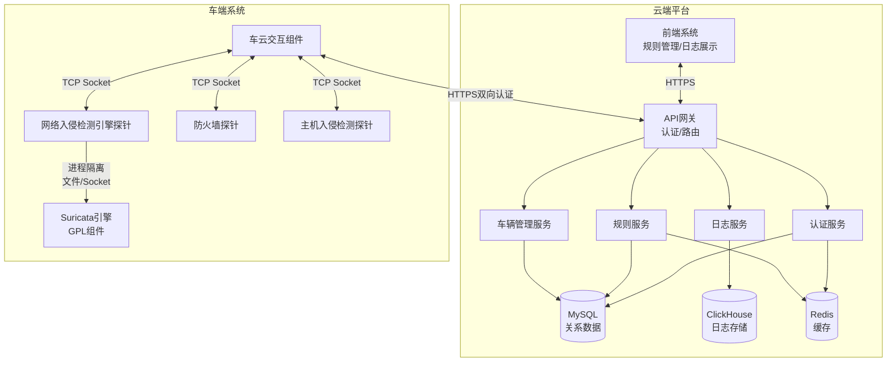
```mermaid
graph TB
    subgraph Cloud["云端平台"]
        FE[前端系统<br/>规则管理/日志展示]
        Gateway[API网关<br/>认证/路由]
        AuthSvc[认证服务]
        RuleSvc[规则服务]
        LogSvc[日志服务]
        VehicleSvc[车辆管理服务]
        MySQL[(MySQL<br/>关系数据)]
        ClickHouse[(ClickHouse<br/>日志存储)]
        Redis[(Redis<br/>缓存)]
    end

    subgraph Vehicle["车端系统"]
        Connector[车云交互组件]
        NetProbe[网络入侵检测引擎探针]
        FwProbe[防火墙探针]
        HostProbe[主机入侵检测探针]
        Suricata[Suricata引擎<br/>GPL组件]
    end

    FE <-->|HTTPS| Gateway
    Gateway --> AuthSvc
    Gateway --> RuleSvc
    Gateway --> LogSvc
    Gateway --> VehicleSvc

    AuthSvc --> MySQL
    RuleSvc --> MySQL
    VehicleSvc --> MySQL
    LogSvc --> ClickHouse

    AuthSvc --> Redis
    RuleSvc --> Redis

    Connector <-->|HTTPS双向认证| Gateway

    Connector <-->|TCP Socket| NetProbe
    Connector <-->|TCP Socket| FwProbe
    Connector <-->|TCP Socket| HostProbe

    NetProbe -->|进程隔离<br/>文件/Socket| Suricata
```

### 1.2 开源合规隔离设计

为避免GPL协议传染，采用严格的进程隔离策略。

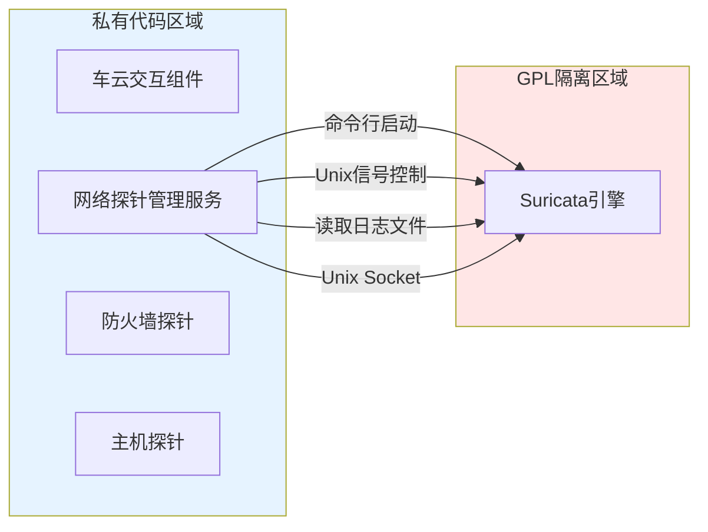
```mermaid
graph LR
    subgraph Private["私有代码区域"]
        Connector[车云交互组件]
        NetMgmt[网络探针管理服务]
        FwProbe[防火墙探针]
        HostProbe[主机探针]
    end

    subgraph GPL["GPL隔离区域"]
        Suricata[Suricata引擎]
    end

    NetMgmt -->|命令行启动| Suricata
    NetMgmt -->|Unix信号控制| Suricata
    NetMgmt -->|读取日志文件| Suricata
    NetMgmt -->|Unix Socket| Suricata

    style GPL fill:#ffe6e6
    style Private fill:#e6f3ff
```

**隔离机制**：
- **进程隔离**：Suricata作为独立进程运行
- **通信方式**：标准IPC（Socket、文件、信号）
- **无代码链接**：不直接链接GPL库
- **接口标准化**：使用标准输入输出和配置文件

### 1.3 车端组件架构

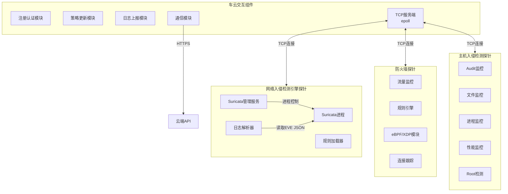
```mermaid
graph TB
    subgraph CloudConnector["车云交互组件"]
        RegModule[注册认证模块]
        PolicyModule[策略更新模块]
        LogModule[日志上报模块]
        CommModule[通信模块]
        TCPServer[TCP服务端<br/>epoll]
    end

    subgraph NetworkProbe["网络入侵检测引擎探针"]
        SuricataMgmt[Suricata管理服务]
        RuleLoader[规则加载器]
        LogParser[日志解析器]
        Suricata[Suricata进程]
    end

    subgraph FirewallProbe["防火墙探针"]
        TrafficMonitor[流量监控]
        RuleEngine[规则引擎]
        eBPF[eBPF/XDP模块]
        ConnTracker[连接跟踪]
    end

    subgraph HostProbe["主机入侵检测探针"]
        AuditMonitor[Audit监控]
        FileMonitor[文件监控]
        ProcessMonitor[进程监控]
        PerfMonitor[性能监控]
        RootDetector[Root检测]
    end

    TCPServer <-->|TCP连接| NetworkProbe
    TCPServer <-->|TCP连接| FirewallProbe
    TCPServer <-->|TCP连接| HostProbe

    CommModule -->|HTTPS| CloudAPI[云端API]

    SuricataMgmt -->|进程控制| Suricata
    LogParser -->|读取EVE JSON| Suricata
```

### 1.4 云端微服务架构

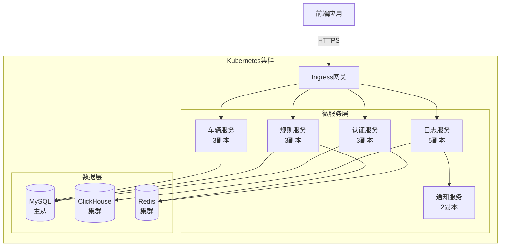
```mermaid
graph TB
    Client[前端应用]

    subgraph K8S["Kubernetes集群"]
        Ingress[Ingress网关]

        subgraph Services["微服务层"]
            AuthSvc[认证服务<br/>3副本]
            RuleSvc[规则服务<br/>3副本]
            LogSvc[日志服务<br/>5副本]
            VehicleSvc[车辆服务<br/>3副本]
            NotifySvc[通知服务<br/>2副本]
        end

        subgraph Data["数据层"]
            MySQLPod[(MySQL<br/>主从)]
            ClickHousePod[(ClickHouse<br/>集群)]
            RedisPod[(Redis<br/>集群)]
        end
    end

    Client -->|HTTPS| Ingress
    Ingress --> AuthSvc
    Ingress --> RuleSvc
    Ingress --> LogSvc
    Ingress --> VehicleSvc

    AuthSvc --> MySQLPod
    AuthSvc --> RedisPod
    RuleSvc --> MySQLPod
    RuleSvc --> RedisPod
    VehicleSvc --> MySQLPod
    LogSvc --> ClickHousePod
    LogSvc --> NotifySvc
```

## 2. 车端详细设计

### 2.1 车云交互组件设计

#### 2.1.1 组件架构

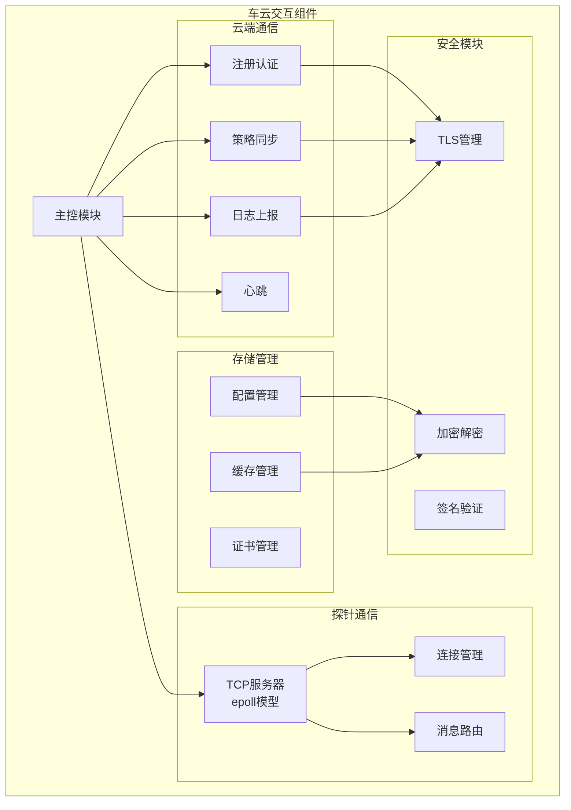
```mermaid
graph TB
    subgraph Connector["车云交互组件"]
        Main[主控模块]

        subgraph CloudComm["云端通信"]
            RegAuth[注册认证]
            PolicySync[策略同步]
            LogUpload[日志上报]
            Heartbeat[心跳]
        end

        subgraph ProbeComm["探针通信"]
            TCPServer[TCP服务器<br/>epoll模型]
            ConnMgr[连接管理]
            MsgRouter[消息路由]
        end

        subgraph Storage["存储管理"]
            ConfigMgr[配置管理]
            CacheMgr[缓存管理]
            CertMgr[证书管理]
        end

        subgraph Security["安全模块"]
            TLSMgr[TLS管理]
            Crypto[加密解密]
            Signer[签名验证]
        end
    end

    Main --> RegAuth
    Main --> PolicySync
    Main --> LogUpload
    Main --> Heartbeat
    Main --> TCPServer

    TCPServer --> ConnMgr
    TCPServer --> MsgRouter

    RegAuth --> TLSMgr
    PolicySync --> TLSMgr
    LogUpload --> TLSMgr

    ConfigMgr --> Crypto
    CacheMgr --> Crypto
```

#### 2.1.2 TCP服务器设计

采用epoll模型实现高性能TCP服务器。

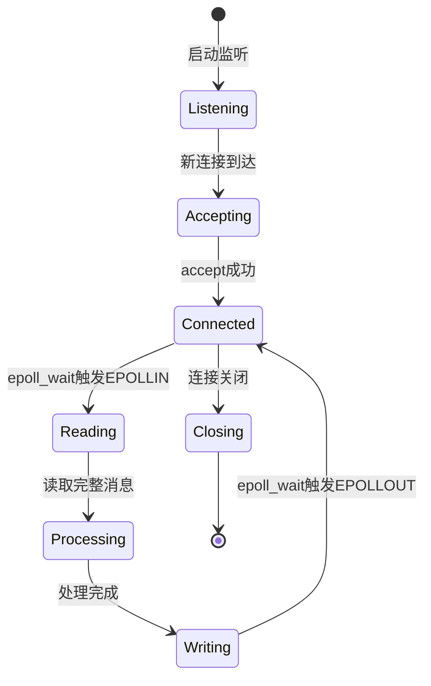
```mermaid
stateDiagram-v2
    [*] --> Listening: 启动监听
    Listening --> Accepting: 新连接到达
    Accepting --> Connected: accept成功
    Connected --> Reading: epoll_wait触发EPOLLIN
    Reading --> Processing: 读取完整消息
    Processing --> Writing: 处理完成
    Writing --> Connected: epoll_wait触发EPOLLOUT
    Connected --> Closing: 连接关闭
    Closing --> [*]
```

**数据结构设计**：

```c
// 连接上下文
typedef struct {
    int fd;                      // socket文件描述符
    char probe_type[32];         // 探针类型：network/firewall/host
    time_t connect_time;         // 连接时间
    time_t last_active;          // 最后活跃时间

    // 接收缓冲区
    char recv_buf[8192];
    int recv_len;

    // 发送缓冲区
    char send_buf[8192];
    int send_len;
    int send_pos;

    // 状态
    enum {
        CONN_INIT,
        CONN_AUTHENTICATED,
        CONN_ACTIVE
    } state;
} connection_t;

// TCP服务器
typedef struct {
    int listen_fd;               // 监听socket
    int epoll_fd;                // epoll文件描述符
    uint16_t port;               // 监听端口

    connection_t* connections[MAX_PROBES];  // 探针连接数组
    int conn_count;

    pthread_t thread_id;         // 工作线程
    volatile int running;        // 运行标志
} tcp_server_t;
```

**epoll事件处理**：

```c
void tcp_server_event_loop(tcp_server_t* server) {
    struct epoll_event events[MAX_EVENTS];

    while (server->running) {
        int nfds = epoll_wait(server->epoll_fd, events, MAX_EVENTS, 1000);

        for (int i = 0; i < nfds; i++) {
            int fd = events[i].data.fd;

            if (fd == server->listen_fd) {
                // 新连接
                handle_accept(server);
            } else if (events[i].events & EPOLLIN) {
                // 可读事件
                handle_read(server, fd);
            } else if (events[i].events & EPOLLOUT) {
                // 可写事件
                handle_write(server, fd);
            } else if (events[i].events & (EPOLLERR | EPOLLHUP)) {
                // 错误或挂断
                handle_close(server, fd);
            }
        }
    }
}
```

#### 2.1.3 注册认证模块

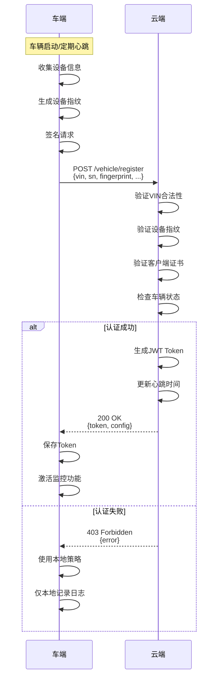
```mermaid
sequenceDiagram
    participant Vehicle as 车端
    participant Cloud as 云端

    Note over Vehicle: 车辆启动/定期心跳
    Vehicle->>Vehicle: 收集设备信息
    Vehicle->>Vehicle: 生成设备指纹
    Vehicle->>Vehicle: 签名请求

    Vehicle->>Cloud: POST /vehicle/register<br/>{vin, sn, fingerprint, ...}

    Cloud->>Cloud: 验证VIN合法性
    Cloud->>Cloud: 验证设备指纹
    Cloud->>Cloud: 验证客户端证书
    Cloud->>Cloud: 检查车辆状态

    alt 认证成功
        Cloud->>Cloud: 生成JWT Token
        Cloud->>Cloud: 更新心跳时间
        Cloud-->>Vehicle: 200 OK<br/>{token, config}
        Vehicle->>Vehicle: 保存Token
        Vehicle->>Vehicle: 激活监控功能
    else 认证失败
        Cloud-->>Vehicle: 403 Forbidden<br/>{error}
        Vehicle->>Vehicle: 使用本地策略
        Vehicle->>Vehicle: 仅本地记录日志
    end
```

**设备指纹生成算法**：

```c
char* generate_device_fingerprint() {
    // 收集硬件特征
    char* cpu_id = get_cpu_serial();           // CPU序列号
    char* mac_addr = get_primary_mac();        // 主网卡MAC
    char* disk_id = get_disk_serial();         // 磁盘序列号
    char* board_id = get_board_serial();       // 主板序列号

    // 组合特征
    char raw[512];
    snprintf(raw, sizeof(raw), "%s|%s|%s|%s",
             cpu_id, mac_addr, disk_id, board_id);

    // SHA256哈希
    unsigned char hash[32];
    SHA256((unsigned char*)raw, strlen(raw), hash);

    // 转hex字符串
    char* fingerprint = malloc(65);
    for (int i = 0; i < 32; i++) {
        sprintf(fingerprint + i*2, "%02x", hash[i]);
    }

    return fingerprint;
}
```

#### 2.1.4 策略更新模块

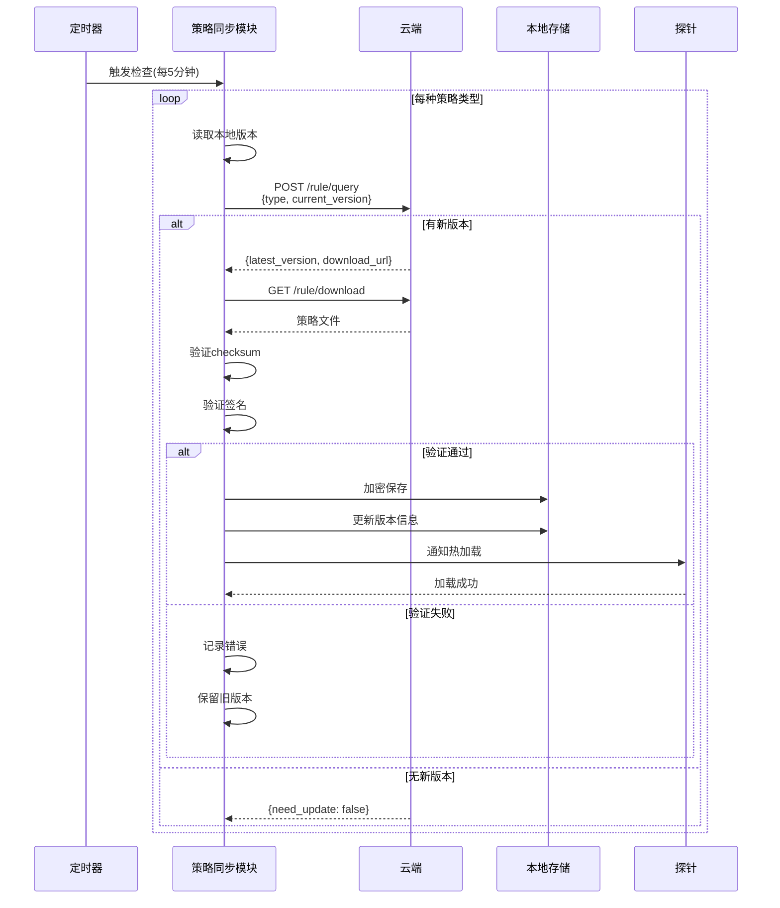
```mermaid
sequenceDiagram
    participant Timer as 定时器
    participant PolicySync as 策略同步模块
    participant Cloud as 云端
    participant Storage as 本地存储
    participant Probes as 探针

    Timer->>PolicySync: 触发检查(每5分钟)

    loop 每种策略类型
        PolicySync->>PolicySync: 读取本地版本
        PolicySync->>Cloud: POST /rule/query<br/>{type, current_version}

        alt 有新版本
            Cloud-->>PolicySync: {latest_version, download_url}
            PolicySync->>Cloud: GET /rule/download
            Cloud-->>PolicySync: 策略文件

            PolicySync->>PolicySync: 验证checksum
            PolicySync->>PolicySync: 验证签名

            alt 验证通过
                PolicySync->>Storage: 加密保存
                PolicySync->>Storage: 更新版本信息
                PolicySync->>Probes: 通知热加载
                Probes-->>PolicySync: 加载成功
            else 验证失败
                PolicySync->>PolicySync: 记录错误
                PolicySync->>PolicySync: 保留旧版本
            end
        else 无新版本
            Cloud-->>PolicySync: {need_update: false}
        end
    end
```

**策略文件管理**：

```c
typedef struct {
    char type[32];              // network/firewall/host
    char version[32];           // 版本号
    char checksum[65];          // SHA256
    char signature[256];        // RSA签名
    time_t update_time;         // 更新时间
    char file_path[256];        // 文件路径
} policy_info_t;

// 策略更新
int update_policy(const char* type, const char* data, size_t len) {
    // 1. 验证checksum
    unsigned char hash[32];
    SHA256((unsigned char*)data, len, hash);
    char checksum[65];
    hex_encode(hash, 32, checksum);

    if (strcmp(checksum, expected_checksum) != 0) {
        return -1;  // 校验失败
    }

    // 2. 验证签名
    if (!verify_signature(data, len, signature)) {
        return -2;  // 签名验证失败
    }

    // 3. 加密存储
    unsigned char encrypted[len + 16];
    int enc_len = aes_gcm_encrypt(data, len, encrypted);

    // 4. 写入文件
    char path[256];
    snprintf(path, sizeof(path), "/data/idps/config/%s_rules.enc", type);
    write_file(path, encrypted, enc_len);

    // 5. 更新版本信息
    update_version_info(type, version, checksum);

    return 0;
}
```

#### 2.1.5 日志上报模块

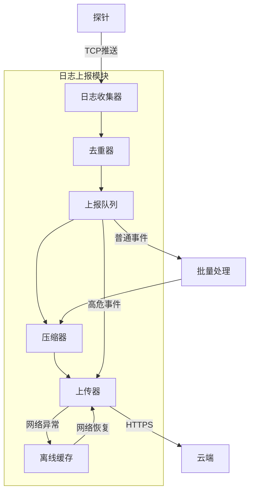
```mermaid
graph TB
    subgraph LogUpload["日志上报模块"]
        Collector[日志收集器]
        Queue[上报队列]
        Deduplicator[去重器]
        Compressor[压缩器]
        Uploader[上传器]
        Cache[离线缓存]
    end

    Probes[探针] -->|TCP推送| Collector
    Collector --> Deduplicator
    Deduplicator --> Queue

    Queue --> Compressor
    Compressor --> Uploader

    Uploader -->|HTTPS| Cloud[云端]

    Uploader -->|网络异常| Cache
    Cache -->|网络恢复| Uploader

    Queue -->|高危事件| Uploader
    Queue -->|普通事件| Batch[批量处理]
    Batch --> Compressor
```

**去重策略**：

```c
typedef struct {
    char fingerprint[33];        // 事件指纹MD5
    time_t first_time;           // 首次出现时间
    time_t last_time;            // 最后出现时间
    int count;                   // 出现次数
} event_fingerprint_t;

// 事件指纹计算
char* calculate_event_fingerprint(const char* log) {
    json_t* json = json_loads(log, 0, NULL);

    // 提取关键字段
    const char* event_type = json_string_value(json_object_get(json, "event_type"));
    const char* src_ip = json_string_value(json_object_get(json, "src_ip"));
    const char* dst_ip = json_string_value(json_object_get(json, "dst_ip"));
    int dst_port = json_integer_value(json_object_get(json, "dst_port"));
    const char* message = json_string_value(json_object_get(json, "message"));

    // 组合关键字段
    char raw[512];
    snprintf(raw, sizeof(raw), "%s|%s|%s|%d|%s",
             event_type, src_ip, dst_ip, dst_port, message);

    // MD5哈希
    unsigned char hash[16];
    MD5((unsigned char*)raw, strlen(raw), hash);

    char* fingerprint = malloc(33);
    for (int i = 0; i < 16; i++) {
        sprintf(fingerprint + i*2, "%02x", hash[i]);
    }

    json_decref(json);
    return fingerprint;
}

// 去重检查
bool should_report_event(const char* log) {
    char* fingerprint = calculate_event_fingerprint(log);
    time_t now = time(NULL);

    event_fingerprint_t* entry = hashtable_get(dedup_table, fingerprint);

    if (entry == NULL) {
        // 首次出现，创建记录
        entry = malloc(sizeof(event_fingerprint_t));
        strcpy(entry->fingerprint, fingerprint);
        entry->first_time = now;
        entry->last_time = now;
        entry->count = 1;
        hashtable_put(dedup_table, fingerprint, entry);
        free(fingerprint);
        return true;  // 上报
    }

    // 时间窗口检查（5分钟）
    if (now - entry->first_time > 300) {
        // 超过时间窗口，重置计数
        entry->first_time = now;
        entry->count = 1;
        free(fingerprint);
        return true;
    }

    // 频率限制检查（1分钟内最多10次）
    if (now - entry->last_time < 60 && entry->count >= 10) {
        free(fingerprint);
        return false;  // 不上报
    }

    entry->last_time = now;
    entry->count++;
    free(fingerprint);
    return true;
}
```

**批量上报**：

```c
void batch_upload_worker(void* arg) {
    log_queue_t* queue = (log_queue_t*)arg;

    while (running) {
        sleep(300);  // 每5分钟

        // 收集普通事件
        json_t* logs = json_array();

        pthread_mutex_lock(&queue->mutex);
        while (queue->count > 0 && json_array_size(logs) < 100) {
            log_entry_t* entry = queue_pop(queue);
            if (entry->severity < 4) {  // 非高危
                json_array_append_new(logs, json_loads(entry->data, 0, NULL));
            }
        }
        pthread_mutex_unlock(&queue->mutex);

        if (json_array_size(logs) == 0) {
            json_decref(logs);
            continue;
        }

        // 压缩
        char* json_str = json_dumps(logs, JSON_COMPACT);
        size_t compressed_len;
        unsigned char* compressed = gzip_compress(json_str, strlen(json_str), &compressed_len);

        // 上报
        http_response_t* resp = http_post("/log/batch",
                                          compressed, compressed_len,
                                          "Content-Encoding: gzip");

        if (resp->status_code == 200) {
            // 成功
        } else {
            // 失败，写入离线缓存
            cache_logs(json_str);
        }

        free(json_str);
        free(compressed);
        json_decref(logs);
    }
}
```

### 2.2 网络入侵检测引擎探针设计

#### 2.2.1 组件架构

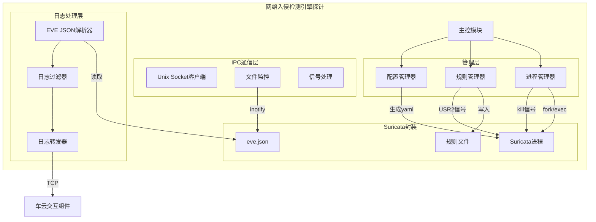
```mermaid
graph TB
    subgraph NetworkProbe["网络入侵检测引擎探针"]
        Main[主控模块]

        subgraph Management["管理层"]
            ProcMgr[进程管理器]
            RuleMgr[规则管理器]
            ConfigMgr[配置管理器]
        end

        subgraph IPC["IPC通信层"]
            UnixSocket[Unix Socket客户端]
            FileWatcher[文件监控]
            SignalHandler[信号处理]
        end

        subgraph LogProcessing["日志处理层"]
            EVEParser[EVE JSON解析器]
            LogFilter[日志过滤器]
            LogForwarder[日志转发器]
        end

        subgraph SuricataWrapper["Suricata封装"]
            SuricataProc[Suricata进程]
            EVELog[eve.json]
            RuleFiles[规则文件]
        end
    end

    Main --> ProcMgr
    Main --> RuleMgr
    Main --> ConfigMgr

    ProcMgr -->|fork/exec| SuricataProc
    ProcMgr -->|kill信号| SuricataProc

    RuleMgr -->|写入| RuleFiles
    RuleMgr -->|USR2信号| SuricataProc

    ConfigMgr -->|生成yaml| SuricataProc

    FileWatcher -->|inotify| EVELog
    EVEParser -->|读取| EVELog
    EVEParser --> LogFilter
    LogFilter --> LogForwarder

    LogForwarder -->|TCP| Connector[车云交互组件]
```

#### 2.2.2 Suricata进程管理

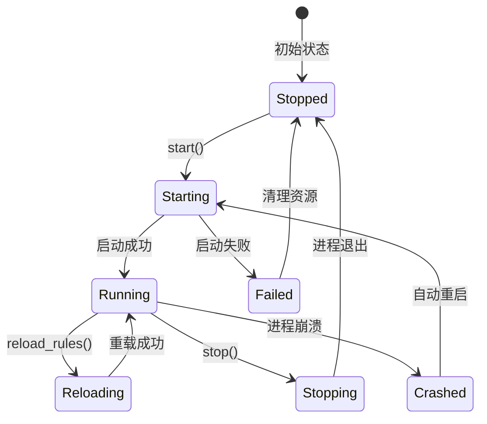
```mermaid
stateDiagram-v2
    [*] --> Stopped: 初始状态
    Stopped --> Starting: start()
    Starting --> Running: 启动成功
    Starting --> Failed: 启动失败
    Failed --> Stopped: 清理资源
    Running --> Reloading: reload_rules()
    Reloading --> Running: 重载成功
    Running --> Stopping: stop()
    Stopping --> Stopped: 进程退出
    Running --> Crashed: 进程崩溃
    Crashed --> Starting: 自动重启
```

**进程管理代码**：

```c
typedef struct {
    pid_t pid;                   // Suricata进程ID
    int status;                  // 运行状态
    time_t start_time;           // 启动时间
    int restart_count;           // 重启次数

    char config_file[256];       // 配置文件路径
    char log_dir[256];           // 日志目录
    char rule_dir[256];          // 规则目录
} suricata_manager_t;

// 启动Suricata
int start_suricata(suricata_manager_t* mgr) {
    pid_t pid = fork();

    if (pid == 0) {
        // 子进程：执行Suricata
        char* argv[] = {
            "/usr/local/bin/suricata",
            "-c", mgr->config_file,
            "-D",                       // 守护进程模式
            "--af-packet=eth0",         // 监听网卡
            "-l", mgr->log_dir,         // 日志目录
            NULL
        };

        execv(argv[0], argv);
        exit(1);  // execv失败
    } else if (pid > 0) {
        // 父进程：记录PID
        mgr->pid = pid;
        mgr->status = STATUS_RUNNING;
        mgr->start_time = time(NULL);

        // 等待进程启动
        sleep(2);

        // 检查进程是否存活
        if (kill(pid, 0) == 0) {
            log_info("Suricata started, PID=%d", pid);
            return 0;
        } else {
            log_error("Suricata start failed");
            mgr->status = STATUS_FAILED;
            return -1;
        }
    } else {
        log_error("fork failed");
        return -1;
    }
}

// 热加载规则
int reload_rules(suricata_manager_t* mgr) {
    if (mgr->pid <= 0) {
        return -1;
    }

    // 发送USR2信号触发规则重载
    if (kill(mgr->pid, SIGUSR2) == 0) {
        log_info("Sent SIGUSR2 to Suricata PID=%d", mgr->pid);
        return 0;
    } else {
        log_error("Failed to send signal to Suricata");
        return -1;
    }
}

// 监控进程
void monitor_suricata(suricata_manager_t* mgr) {
    while (1) {
        sleep(5);

        if (mgr->status != STATUS_RUNNING) {
            continue;
        }

        // 检查进程是否存活
        if (kill(mgr->pid, 0) != 0) {
            log_error("Suricata crashed, restarting...");
            mgr->status = STATUS_CRASHED;
            mgr->restart_count++;

            // 限制重启次数
            if (mgr->restart_count > 5) {
                log_error("Too many restarts, giving up");
                mgr->status = STATUS_FAILED;
                continue;
            }

            // 重启
            start_suricata(mgr);
        }
    }
}
```

#### 2.2.3 EVE日志解析

```c
typedef struct {
    char* file_path;             // EVE日志文件路径
    FILE* fp;                    // 文件指针
    long last_pos;               // 上次读取位置
    int inotify_fd;              // inotify文件描述符
    int watch_fd;                // watch描述符
} eve_parser_t;

// 初始化解析器
eve_parser_t* eve_parser_init(const char* file_path) {
    eve_parser_t* parser = malloc(sizeof(eve_parser_t));
    parser->file_path = strdup(file_path);
    parser->last_pos = 0;

    // 打开文件
    parser->fp = fopen(file_path, "r");
    if (!parser->fp) {
        log_error("Failed to open %s", file_path);
        free(parser);
        return NULL;
    }

    // 设置inotify监控
    parser->inotify_fd = inotify_init();
    parser->watch_fd = inotify_add_watch(parser->inotify_fd, file_path, IN_MODIFY);

    return parser;
}

// 读取新日志
void eve_parser_read_new_logs(eve_parser_t* parser, log_callback_t callback) {
    // 等待文件修改事件
    struct inotify_event event;
    read(parser->inotify_fd, &event, sizeof(event));

    // 跳到上次位置
    fseek(parser->fp, parser->last_pos, SEEK_SET);

    char line[8192];
    while (fgets(line, sizeof(line), parser->fp)) {
        // 解析JSON
        json_t* json = json_loads(line, 0, NULL);
        if (!json) {
            continue;
        }

        // 提取字段
        const char* event_type = json_string_value(json_object_get(json, "event_type"));

        // 只处理alert事件
        if (strcmp(event_type, "alert") == 0) {
            // 回调处理
            callback(json);
        }

        json_decref(json);
    }

    // 更新位置
    parser->last_pos = ftell(parser->fp);
}

// 日志处理回调
void handle_alert(json_t* json) {
    // 提取alert信息
    json_t* alert = json_object_get(json, "alert");
    int sid = json_integer_value(json_object_get(alert, "signature_id"));
    const char* signature = json_string_value(json_object_get(alert, "signature"));
    int severity = json_integer_value(json_object_get(alert, "severity"));

    // 提取流信息
    const char* src_ip = json_string_value(json_object_get(json, "src_ip"));
    const char* dest_ip = json_string_value(json_object_get(json, "dest_ip"));
    int src_port = json_integer_value(json_object_get(json, "src_port"));
    int dest_port = json_integer_value(json_object_get(json, "dest_port"));
    const char* proto = json_string_value(json_object_get(json, "proto"));

    // 构造上报日志
    json_t* log = json_object();
    json_object_set_new(log, "id", json_string(generate_uuid()));
    json_object_set_new(log, "timestamp", json_integer(time(NULL)));
    json_object_set_new(log, "probe", json_string("network"));
    json_object_set_new(log, "event_type", json_string("alert"));
    json_object_set_new(log, "severity", json_integer(severity));
    json_object_set_new(log, "source_ip", json_string(src_ip));
    json_object_set_new(log, "dest_ip", json_string(dest_ip));
    json_object_set_new(log, "source_port", json_integer(src_port));
    json_object_set_new(log, "dest_port", json_integer(dest_port));
    json_object_set_new(log, "protocol", json_string(proto));
    json_object_set_new(log, "message", json_string(signature));
    json_object_set_new(log, "signature_id", json_integer(sid));

    // 转发到车云交互组件
    forward_log_to_connector(log);

    json_decref(log);
}
```

### 2.3 防火墙探针设计

#### 2.3.1 组件架构

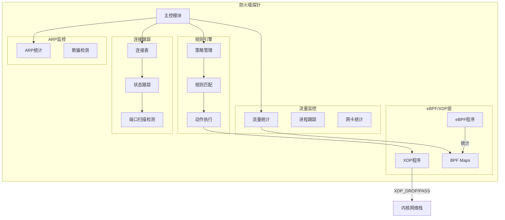
```mermaid
graph TB
    subgraph FirewallProbe["防火墙探针"]
        Main[主控模块]

        subgraph TrafficMon["流量监控"]
            FlowStats[流量统计]
            ProcTracker[进程跟踪]
            InterfaceStats[网卡统计]
        end

        subgraph RuleEngine["规则引擎"]
            PolicyMgr[策略管理]
            RuleMatcher[规则匹配]
            ActionExecutor[动作执行]
        end

        subgraph eBPFLayer["eBPF/XDP层"]
            XDPProg[XDP程序]
            eBPFProg[eBPF程序]
            BPFMaps[BPF Maps]
        end

        subgraph ConnTrack["连接跟踪"]
            ConnTable[连接表]
            StateTracker[状态跟踪]
            PortScanDetector[端口扫描检测]
        end

        subgraph ARPMon["ARP监控"]
            ARPStats[ARP统计]
            SpoofDetector[欺骗检测]
        end
    end

    Main --> FlowStats
    Main --> PolicyMgr
    Main --> ConnTable
    Main --> ARPStats

    FlowStats --> BPFMaps
    PolicyMgr --> RuleMatcher
    RuleMatcher --> ActionExecutor
    ActionExecutor --> XDPProg

    ConnTable --> StateTracker
    StateTracker --> PortScanDetector

    XDPProg -->|XDP_DROP/PASS| Kernel[内核网络栈]
    eBPFProg -->|统计| BPFMaps
```

#### 2.3.2 eBPF/XDP实现

**XDP程序示例**（用于包过滤）：

```c
// xdp_firewall.c
#include <linux/bpf.h>
#include <linux/if_ether.h>
#include <linux/ip.h>
#include <linux/tcp.h>
#include <linux/udp.h>
#include <bpf/bpf_helpers.h>

// 规则表
struct firewall_rule {
    __u32 src_ip;
    __u32 dst_ip;
    __u16 dst_port;
    __u8 protocol;
    __u8 action;  // 0: PASS, 1: DROP
};

struct {
    __uint(type, BPF_MAP_TYPE_HASH);
    __type(key, __u32);           // 规则ID
    __type(value, struct firewall_rule);
    __uint(max_entries, 1024);
} firewall_rules SEC(".maps");

// 连接跟踪表
struct connection_key {
    __u32 src_ip;
    __u32 dst_ip;
    __u16 src_port;
    __u16 dst_port;
    __u8 protocol;
};

struct connection_value {
    __u64 packets;
    __u64 bytes;
    __u64 last_seen;
    __u8 initiated;  // 1: 本机发起
};

struct {
    __uint(type, BPF_MAP_TYPE_LRU_HASH);
    __type(key, struct connection_key);
    __type(value, struct connection_value);
    __uint(max_entries, 10000);
} conn_track SEC(".maps");

// 流量统计
struct traffic_stats {
    __u64 rx_packets;
    __u64 rx_bytes;
    __u64 tx_packets;
    __u64 tx_bytes;
};

struct {
    __uint(type, BPF_MAP_TYPE_ARRAY);
    __type(key, __u32);           // 进程PID
    __type(value, struct traffic_stats);
    __uint(max_entries, 1024);
} proc_stats SEC(".maps");

SEC("xdp")
int xdp_firewall_prog(struct xdp_md *ctx) {
    void *data_end = (void *)(long)ctx->data_end;
    void *data = (void *)(long)ctx->data;

    // 解析以太网头
    struct ethhdr *eth = data;
    if ((void *)(eth + 1) > data_end)
        return XDP_PASS;

    if (eth->h_proto != htons(ETH_P_IP))
        return XDP_PASS;

    // 解析IP头
    struct iphdr *ip = (void *)(eth + 1);
    if ((void *)(ip + 1) > data_end)
        return XDP_PASS;

    __u32 src_ip = ip->saddr;
    __u32 dst_ip = ip->daddr;
    __u8 protocol = ip->protocol;
    __u16 src_port = 0, dst_port = 0;

    // 解析传输层
    if (protocol == IPPROTO_TCP) {
        struct tcphdr *tcp = (void *)ip + (ip->ihl * 4);
        if ((void *)(tcp + 1) > data_end)
            return XDP_PASS;
        src_port = ntohs(tcp->source);
        dst_port = ntohs(tcp->dest);
    } else if (protocol == IPPROTO_UDP) {
        struct udphdr *udp = (void *)ip + (ip->ihl * 4);
        if ((void *)(udp + 1) > data_end)
            return XDP_PASS;
        src_port = ntohs(udp->source);
        dst_port = ntohs(udp->dest);
    }

    // 连接跟踪
    struct connection_key conn_key = {
        .src_ip = src_ip,
        .dst_ip = dst_ip,
        .src_port = src_port,
        .dst_port = dst_port,
        .protocol = protocol
    };

    struct connection_value *conn = bpf_map_lookup_elem(&conn_track, &conn_key);
    if (conn) {
        __sync_fetch_and_add(&conn->packets, 1);
        __sync_fetch_and_add(&conn->bytes, data_end - data);
        conn->last_seen = bpf_ktime_get_ns();
    } else {
        struct connection_value new_conn = {
            .packets = 1,
            .bytes = data_end - data,
            .last_seen = bpf_ktime_get_ns(),
            .initiated = 0
        };
        bpf_map_update_elem(&conn_track, &conn_key, &new_conn, BPF_NOEXIST);
    }

    // 规则匹配
    for (__u32 i = 0; i < 1024; i++) {
        struct firewall_rule *rule = bpf_map_lookup_elem(&firewall_rules, &i);
        if (!rule)
            continue;

        // 匹配源IP
        if (rule->src_ip != 0 && rule->src_ip != src_ip)
            continue;

        // 匹配目的IP
        if (rule->dst_ip != 0 && rule->dst_ip != dst_ip)
            continue;

        // 匹配目的端口
        if (rule->dst_port != 0 && rule->dst_port != dst_port)
            continue;

        // 匹配协议
        if (rule->protocol != 0 && rule->protocol != protocol)
            continue;

        // 执行动作
        if (rule->action == 1) {
            return XDP_DROP;  // 丢弃
        } else {
            return XDP_PASS;  // 放行
        }
    }

    return XDP_PASS;  // 默认放行
}

char _license[] SEC("license") = "GPL";
```

**用户态控制程序**：

```c
// firewall_control.c
#include <bpf/libbpf.h>
#include <bpf/bpf.h>

typedef struct {
    struct bpf_object *obj;
    struct bpf_program *prog;
    int prog_fd;
    int rules_map_fd;
    int conn_track_map_fd;
    int stats_map_fd;

    char ifname[16];
    int ifindex;
} firewall_ctx_t;

// 初始化
firewall_ctx_t* firewall_init(const char* ifname) {
    firewall_ctx_t* ctx = calloc(1, sizeof(firewall_ctx_t));
    strcpy(ctx->ifname, ifname);
    ctx->ifindex = if_nametoindex(ifname);

    // 加载BPF程序
    ctx->obj = bpf_object__open_file("xdp_firewall.o", NULL);
    if (!ctx->obj) {
        log_error("Failed to open BPF object");
        free(ctx);
        return NULL;
    }

    if (bpf_object__load(ctx->obj) != 0) {
        log_error("Failed to load BPF object");
        bpf_object__close(ctx->obj);
        free(ctx);
        return NULL;
    }

    // 获取程序
    ctx->prog = bpf_object__find_program_by_name(ctx->obj, "xdp_firewall_prog");
    ctx->prog_fd = bpf_program__fd(ctx->prog);

    // 获取map fd
    struct bpf_map *map;
    map = bpf_object__find_map_by_name(ctx->obj, "firewall_rules");
    ctx->rules_map_fd = bpf_map__fd(map);

    map = bpf_object__find_map_by_name(ctx->obj, "conn_track");
    ctx->conn_track_map_fd = bpf_map__fd(map);

    map = bpf_object__find_map_by_name(ctx->obj, "proc_stats");
    ctx->stats_map_fd = bpf_map__fd(map);

    // 附加到网卡
    if (bpf_set_link_xdp_fd(ctx->ifindex, ctx->prog_fd, 0) < 0) {
        log_error("Failed to attach XDP program");
        bpf_object__close(ctx->obj);
        free(ctx);
        return NULL;
    }

    log_info("Firewall attached to %s", ifname);
    return ctx;
}

// 添加规则
int firewall_add_rule(firewall_ctx_t* ctx, uint32_t rule_id,
                      uint32_t src_ip, uint32_t dst_ip,
                      uint16_t dst_port, uint8_t protocol,
                      uint8_t action) {
    struct firewall_rule rule = {
        .src_ip = src_ip,
        .dst_ip = dst_ip,
        .dst_port = dst_port,
        .protocol = protocol,
        .action = action
    };

    if (bpf_map_update_elem(ctx->rules_map_fd, &rule_id, &rule, BPF_ANY) != 0) {
        log_error("Failed to add firewall rule");
        return -1;
    }

    log_info("Added firewall rule %u", rule_id);
    return 0;
}

// 删除规则
int firewall_del_rule(firewall_ctx_t* ctx, uint32_t rule_id) {
    if (bpf_map_delete_elem(ctx->rules_map_fd, &rule_id) != 0) {
        log_error("Failed to delete firewall rule");
        return -1;
    }

    log_info("Deleted firewall rule %u", rule_id);
    return 0;
}

// 读取连接统计
void firewall_dump_connections(firewall_ctx_t* ctx) {
    struct connection_key key, next_key;
    struct connection_value value;

    memset(&key, 0, sizeof(key));

    while (bpf_map_get_next_key(ctx->conn_track_map_fd, &key, &next_key) == 0) {
        if (bpf_map_lookup_elem(ctx->conn_track_map_fd, &next_key, &value) == 0) {
            char src_ip_str[16], dst_ip_str[16];
            inet_ntop(AF_INET, &next_key.src_ip, src_ip_str, sizeof(src_ip_str));
            inet_ntop(AF_INET, &next_key.dst_ip, dst_ip_str, sizeof(dst_ip_str));

            printf("%s:%u -> %s:%u proto=%u packets=%llu bytes=%llu\n",
                   src_ip_str, next_key.src_port,
                   dst_ip_str, next_key.dst_port,
                   next_key.protocol,
                   value.packets, value.bytes);
        }
        key = next_key;
    }
}
```

#### 2.3.3 端口扫描检测

```c
typedef struct {
    uint32_t src_ip;
    uint16_t dst_port;
    time_t timestamps[100];  // 最近100次访问时间
    int count;
} port_access_record_t;

typedef struct {
    int threshold_count;     // 阈值次数
    int time_window;         // 时间窗口（秒）
    int action;              // 0: alert, 1: block
} port_scan_config_t;

// 检测端口扫描
bool detect_port_scan(uint32_t src_ip, uint16_t dst_port,
                      port_scan_config_t* config) {
    // 构造key
    char key[64];
    snprintf(key, sizeof(key), "%u:%u", src_ip, dst_port);

    // 查找记录
    port_access_record_t* record = hashtable_get(port_access_table, key);
    time_t now = time(NULL);

    if (!record) {
        // 创建新记录
        record = calloc(1, sizeof(port_access_record_t));
        record->src_ip = src_ip;
        record->dst_port = dst_port;
        record->timestamps[0] = now;
        record->count = 1;
        hashtable_put(port_access_table, key, record);
        return false;
    }

    // 清理过期记录
    int valid_count = 0;
    for (int i = 0; i < record->count; i++) {
        if (now - record->timestamps[i] < config->time_window) {
            record->timestamps[valid_count++] = record->timestamps[i];
        }
    }
    record->count = valid_count;

    // 添加当前访问
    if (record->count < 100) {
        record->timestamps[record->count++] = now;
    }

    // 检查是否超过阈值
    if (record->count > config->threshold_count) {
        // 生成告警
        json_t* event = json_object();
        json_object_set_new(event, "event_type", json_string("port_scan"));
        json_object_set_new(event, "timestamp", json_integer(now));

        char src_ip_str[16];
        inet_ntop(AF_INET, &src_ip, src_ip_str, sizeof(src_ip_str));
        json_object_set_new(event, "src_ip", json_string(src_ip_str));
        json_object_set_new(event, "dst_port", json_integer(dst_port));
        json_object_set_new(event, "access_count", json_integer(record->count));
        json_object_set_new(event, "time_window", json_integer(config->time_window));
        json_object_set_new(event, "action", json_string(config->action ? "block" : "alert"));

        forward_event(event);
        json_decref(event);

        return true;  // 检测到端口扫描
    }

    return false;
}
```

### 2.4 主机入侵检测探针设计

#### 2.4.1 组件架构

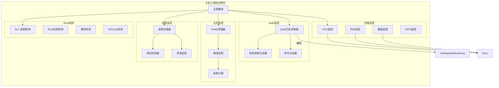
```mermaid
graph TB
    subgraph HostProbe["主机入侵检测探针"]
        Main[主控模块]

        subgraph AuditMon["Audit监控"]
            AuditReader[Audit日志读取器]
            SyscallFilter[系统调用过滤器]
            CmdFilter[命令过滤器]
        end

        subgraph FileMon["文件监控"]
            InotifyMgr[Inotify管理器]
            PathWatcher[路径监控]
            HashCalc[哈希计算]
        end

        subgraph ProcMon["进程监控"]
            ProcScanner[进程扫描器]
            DebugDetector[调试检测器]
            ResourceMonitor[资源监控]
        end

        subgraph PerfMon["性能监控"]
            CPUMonitor[CPU监控]
            MemMonitor[内存监控]
            DiskMonitor[磁盘监控]
            IOPSMonitor[IOPS监控]
        end

        subgraph RootDetect["Root检测"]
            BinaryChecker[Su二进制检测]
            AppChecker[Root应用检测]
            PropChecker[属性检测]
            SELinuxChecker[SELinux检测]
        end
    end

    Main --> AuditReader
    Main --> InotifyMgr
    Main --> ProcScanner
    Main --> CPUMonitor
    Main --> BinaryChecker

    AuditReader -->|解析| AuditLog["/var/log/audit/audit.log"]
    AuditReader --> SyscallFilter
    AuditReader --> CmdFilter

    InotifyMgr --> PathWatcher
    PathWatcher --> HashCalc

    ProcScanner --> DebugDetector
    ProcScanner --> ResourceMonitor

    CPUMonitor --> ProcFS["/proc"]
    MemMonitor --> ProcFS
    DiskMonitor --> ProcFS
```

#### 2.4.2 Audit监控实现

```c
typedef struct {
    char process[64];
    int syscall_ids[32];
    int syscall_count;
} audit_syscall_rule_t;

typedef struct {
    char* commands[32];
    int cmd_count;
} audit_cmd_rule_t;

typedef struct {
    int fd;                      // audit日志文件描述符
    long last_pos;               // 上次读取位置

    audit_syscall_rule_t* syscall_rules;
    int syscall_rule_count;

    audit_cmd_rule_t cmd_rules;
} audit_monitor_t;

// 初始化audit监控
audit_monitor_t* audit_monitor_init(const char* audit_log) {
    audit_monitor_t* mon = calloc(1, sizeof(audit_monitor_t));

    mon->fd = open(audit_log, O_RDONLY);
    if (mon->fd < 0) {
        log_error("Failed to open %s", audit_log);
        free(mon);
        return NULL;
    }

    // 跳到文件末尾
    mon->last_pos = lseek(mon->fd, 0, SEEK_END);

    // 加载规则
    load_audit_rules(mon);

    return mon;
}

// 加载规则
void load_audit_rules(audit_monitor_t* mon) {
    // 从配置文件加载
    json_t* config = load_json_config("/data/idps/config/host_audit_rules.json");

    // 系统调用规则
    json_t* rules = json_object_get(config, "rule");
    size_t index;
    json_t* value;

    mon->syscall_rule_count = json_array_size(rules);
    mon->syscall_rules = calloc(mon->syscall_rule_count, sizeof(audit_syscall_rule_t));

    json_array_foreach(rules, index, value) {
        audit_syscall_rule_t* rule = &mon->syscall_rules[index];

        const char* process = json_string_value(json_object_get(value, "process"));
        strcpy(rule->process, process);

        json_t* syscalls = json_object_get(value, "syscallid");
        size_t i;
        json_t* syscall;
        json_array_foreach(syscalls, i, syscall) {
            rule->syscall_ids[i] = atoi(json_string_value(syscall));
        }
        rule->syscall_count = json_array_size(syscalls);
    }

    // 命令规则
    json_t* cmds = json_object_get(config, "cmd");
    json_array_foreach(cmds, index, value) {
        mon->cmd_rules.commands[index] = strdup(json_string_value(value));
    }
    mon->cmd_rules.cmd_count = json_array_size(cmds);

    json_decref(config);
}

// 读取新的audit日志
void audit_monitor_read_logs(audit_monitor_t* mon) {
    lseek(mon->fd, mon->last_pos, SEEK_SET);

    char line[4096];
    while (read_line(mon->fd, line, sizeof(line)) > 0) {
        // 解析audit日志行
        // 格式: type=SYSCALL msg=audit(1705208400.123:456): arch=c00000b7 syscall=117 ...

        if (strstr(line, "type=SYSCALL")) {
            parse_syscall_log(mon, line);
        } else if (strstr(line, "type=EXECVE")) {
            parse_execve_log(mon, line);
        }
    }

    mon->last_pos = lseek(mon->fd, 0, SEEK_CUR);
}

// 解析系统调用日志
void parse_syscall_log(audit_monitor_t* mon, const char* line) {
    // 提取字段
    int pid = extract_int(line, "pid=");
    int syscall = extract_int(line, "syscall=");
    int uid = extract_int(line, "uid=");
    char comm[64];
    extract_string(line, "comm=", comm, sizeof(comm));

    // 匹配规则
    for (int i = 0; i < mon->syscall_rule_count; i++) {
        audit_syscall_rule_t* rule = &mon->syscall_rules[i];

        // 匹配进程名
        if (strcmp(rule->process, comm) != 0) {
            continue;
        }

        // 匹配系统调用
        bool matched = false;
        for (int j = 0; j < rule->syscall_count; j++) {
            if (rule->syscall_ids[j] == syscall) {
                matched = true;
                break;
            }
        }

        if (matched) {
            // 生成告警
            json_t* event = json_object();
            json_object_set_new(event, "event_type", json_string("audit_syscall"));
            json_object_set_new(event, "timestamp", json_integer(time(NULL)));
            json_object_set_new(event, "pid", json_integer(pid));
            json_object_set_new(event, "process", json_string(comm));
            json_object_set_new(event, "syscall_id", json_integer(syscall));
            json_object_set_new(event, "syscall", json_string(syscall_name(syscall)));
            json_object_set_new(event, "uid", json_integer(uid));

            forward_event(event);
            json_decref(event);
            break;
        }
    }
}

// 解析命令执行日志
void parse_execve_log(audit_monitor_t* mon, const char* line) {
    char cmd[256];
    extract_string(line, "a0=", cmd, sizeof(cmd));

    // 获取命令名
    char* basename = strrchr(cmd, '/');
    if (basename) {
        basename++;
    } else {
        basename = cmd;
    }

    // 匹配命令规则
    for (int i = 0; i < mon->cmd_rules.cmd_count; i++) {
        if (strcmp(mon->cmd_rules.commands[i], basename) == 0) {
            // 生成告警
            json_t* event = json_object();
            json_object_set_new(event, "event_type", json_string("audit_command"));
            json_object_set_new(event, "timestamp", json_integer(time(NULL)));
            json_object_set_new(event, "command", json_string(cmd));

            forward_event(event);
            json_decref(event);
            break;
        }
    }
}
```

#### 2.4.3 文件监控实现

```c
typedef struct {
    int fd;                      // inotify fd
    int wd[256];                 // watch描述符数组
    char* paths[256];            // 监控路径数组
    int path_count;
} file_monitor_t;

// 初始化文件监控
file_monitor_t* file_monitor_init() {
    file_monitor_t* mon = calloc(1, sizeof(file_monitor_t));

    mon->fd = inotify_init();
    if (mon->fd < 0) {
        log_error("inotify_init failed");
        free(mon);
        return NULL;
    }

    // 加载监控路径
    json_t* config = load_json_config("/data/idps/config/host_audit_rules.json");
    json_t* paths = json_object_get(config, "path");

    size_t index;
    json_t* value;
    json_array_foreach(paths, index, value) {
        const char* path = json_string_value(value);
        add_watch_path(mon, path);
    }

    json_decref(config);
    return mon;
}

// 添加监控路径
int add_watch_path(file_monitor_t* mon, const char* path) {
    uint32_t mask = IN_CREATE | IN_DELETE | IN_MODIFY | IN_ATTRIB |
                    IN_MOVED_FROM | IN_MOVED_TO;

    int wd = inotify_add_watch(mon->fd, path, mask);
    if (wd < 0) {
        log_error("Failed to watch %s: %s", path, strerror(errno));
        return -1;
    }

    mon->wd[mon->path_count] = wd;
    mon->paths[mon->path_count] = strdup(path);
    mon->path_count++;

    log_info("Watching %s", path);
    return 0;
}

// 监控文件事件
void file_monitor_watch(file_monitor_t* mon) {
    char buf[4096] __attribute__((aligned(__alignof__(struct inotify_event))));

    while (1) {
        ssize_t len = read(mon->fd, buf, sizeof(buf));
        if (len < 0) {
            if (errno == EINTR) {
                continue;
            }
            log_error("read inotify failed: %s", strerror(errno));
            break;
        }

        // 处理事件
        const struct inotify_event* event;
        for (char* ptr = buf; ptr < buf + len;
             ptr += sizeof(struct inotify_event) + event->len) {
            event = (const struct inotify_event*)ptr;

            handle_file_event(mon, event);
        }
    }
}

// 处理文件事件
void handle_file_event(file_monitor_t* mon, const struct inotify_event* event) {
    // 查找路径
    char* watch_path = NULL;
    for (int i = 0; i < mon->path_count; i++) {
        if (mon->wd[i] == event->wd) {
            watch_path = mon->paths[i];
            break;
        }
    }

    if (!watch_path) {
        return;
    }

    // 构造完整路径
    char full_path[512];
    if (event->len > 0) {
        snprintf(full_path, sizeof(full_path), "%s/%s", watch_path, event->name);
    } else {
        strcpy(full_path, watch_path);
    }

    // 确定操作类型
    const char* operation;
    if (event->mask & IN_CREATE) {
        operation = "create";
    } else if (event->mask & IN_DELETE) {
        operation = "delete";
    } else if (event->mask & IN_MODIFY) {
        operation = "modify";
    } else if (event->mask & IN_ATTRIB) {
        operation = "attribute_change";
    } else if (event->mask & IN_MOVED_FROM) {
        operation = "move_from";
    } else if (event->mask & IN_MOVED_TO) {
        operation = "move_to";
    } else {
        operation = "unknown";
    }

    // 计算文件哈希（仅对修改操作）
    char hash[65] = "";
    if (event->mask & IN_MODIFY && !(event->mask & IN_ISDIR)) {
        calculate_file_hash(full_path, hash);
    }

    // 生成事件
    json_t* log = json_object();
    json_object_set_new(log, "event_type", json_string("file_modification"));
    json_object_set_new(log, "timestamp", json_integer(time(NULL)));
    json_object_set_new(log, "path", json_string(full_path));
    json_object_set_new(log, "operation", json_string(operation));

    if (strlen(hash) > 0) {
        json_object_set_new(log, "new_hash", json_string(hash));
    }

    // 获取进程信息（通过 /proc/self/fd/xxx 追踪）
    // 注意：inotify不直接提供进程信息，这里是简化示例

    forward_event(log);
    json_decref(log);
}

// 计算文件SHA256哈希
void calculate_file_hash(const char* path, char* hash_out) {
    FILE* fp = fopen(path, "rb");
    if (!fp) {
        return;
    }

    SHA256_CTX ctx;
    SHA256_Init(&ctx);

    unsigned char buf[8192];
    size_t n;
    while ((n = fread(buf, 1, sizeof(buf), fp)) > 0) {
        SHA256_Update(&ctx, buf, n);
    }

    unsigned char hash[32];
    SHA256_Final(hash, &ctx);

    for (int i = 0; i < 32; i++) {
        sprintf(hash_out + i*2, "%02x", hash[i]);
    }

    fclose(fp);
}
```

#### 2.4.4 Root检测实现

```c
typedef struct {
    char** su_paths;             // su二进制路径列表
    int su_path_count;

    char** root_packages;        // root应用包名列表
    int root_package_count;

    int check_interval;          // 检查周期（秒）
} root_detector_t;

// 初始化Root检测器
root_detector_t* root_detector_init() {
    root_detector_t* det = calloc(1, sizeof(root_detector_t));

    // 加载配置
    json_t* config = load_json_config("/data/idps/config/host_audit_rules.json");

    // su路径
    json_t* instruct = json_object_get(config, "instruct");
    det->su_path_count = json_array_size(instruct);
    det->su_paths = calloc(det->su_path_count, sizeof(char*));

    size_t index;
    json_t* value;
    json_array_foreach(instruct, index, value) {
        det->su_paths[index] = strdup(json_string_value(value));
    }

    // root应用
    json_t* superapks = json_object_get(config, "superapks");
    det->root_package_count = json_array_size(superapks);
    det->root_packages = calloc(det->root_package_count, sizeof(char*));

    json_array_foreach(superapks, index, value) {
        det->root_packages[index] = strdup(json_string_value(value));
    }

    det->check_interval = json_integer_value(json_object_get(config, "cycle"));

    json_decref(config);
    return det;
}

// Root检测主循环
void root_detector_run(root_detector_t* det) {
    while (1) {
        sleep(det->check_interval);

        json_t* indicators = json_array();
        bool is_rooted = false;

        // 1. 检查su二进制
        for (int i = 0; i < det->su_path_count; i++) {
            if (access(det->su_paths[i], F_OK) == 0) {
                json_t* indicator = json_object();
                json_object_set_new(indicator, "type", json_string("binary"));
                json_object_set_new(indicator, "path", json_string(det->su_paths[i]));
                json_object_set_new(indicator, "exists", json_true());
                json_array_append_new(indicators, indicator);

                is_rooted = true;
            }
        }

        // 2. 检查root应用
        for (int i = 0; i < det->root_package_count; i++) {
            if (is_package_installed(det->root_packages[i])) {
                json_t* indicator = json_object();
                json_object_set_new(indicator, "type", json_string("app"));
                json_object_set_new(indicator, "package", json_string(det->root_packages[i]));
                json_object_set_new(indicator, "installed", json_true());
                json_array_append_new(indicators, indicator);

                is_rooted = true;
            }
        }

        // 3. 检查系统属性
        check_system_properties(indicators, &is_rooted);

        // 4. 检查SELinux状态
        check_selinux_status(indicators, &is_rooted);

        if (is_rooted) {
            // 生成告警
            json_t* event = json_object();
            json_object_set_new(event, "event_type", json_string("root_detection"));
            json_object_set_new(event, "timestamp", json_integer(time(NULL)));
            json_object_set_new(event, "is_rooted", json_true());
            json_object_set_new(event, "indicators", indicators);
            json_object_set_new(event, "action", json_string("alert"));

            forward_event(event);
            json_decref(event);
        } else {
            json_decref(indicators);
        }
    }
}

// 检查应用是否安装
bool is_package_installed(const char* package) {
    char cmd[256];
    snprintf(cmd, sizeof(cmd), "pm list packages | grep %s", package);

    FILE* fp = popen(cmd, "r");
    if (!fp) {
        return false;
    }

    char line[256];
    bool found = false;
    if (fgets(line, sizeof(line), fp) != NULL) {
        found = true;
    }

    pclose(fp);
    return found;
}

// 检查系统属性
void check_system_properties(json_t* indicators, bool* is_rooted) {
    // ro.secure
    char value[32];
    if (get_system_property("ro.secure", value) == 0) {
        int expected = 1;
        int actual = atoi(value);
        if (actual != expected) {
            json_t* indicator = json_object();
            json_object_set_new(indicator, "type", json_string("property"));
            json_object_set_new(indicator, "key", json_string("ro.secure"));
            json_object_set_new(indicator, "expected", json_integer(expected));
            json_object_set_new(indicator, "actual", json_integer(actual));
            json_array_append_new(indicators, indicator);

            *is_rooted = true;
        }
    }

    // ro.debuggable
    if (get_system_property("ro.debuggable", value) == 0) {
        int expected = 0;
        int actual = atoi(value);
        if (actual != expected) {
            json_t* indicator = json_object();
            json_object_set_new(indicator, "type", json_string("property"));
            json_object_set_new(indicator, "key", json_string("ro.debuggable"));
            json_object_set_new(indicator, "expected", json_integer(expected));
            json_object_set_new(indicator, "actual", json_integer(actual));
            json_array_append_new(indicators, indicator);

            *is_rooted = true;
        }
    }

    // service.adb.root
    if (get_system_property("service.adb.root", value) == 0) {
        int expected = 0;
        int actual = atoi(value);
        if (actual != expected) {
            json_t* indicator = json_object();
            json_object_set_new(indicator, "type", json_string("property"));
            json_object_set_new(indicator, "key", json_string("service.adb.root"));
            json_object_set_new(indicator, "expected", json_integer(expected));
            json_object_set_new(indicator, "actual", json_integer(actual));
            json_array_append_new(indicators, indicator);

            *is_rooted = true;
        }
    }
}

// 检查SELinux状态
void check_selinux_status(json_t* indicators, bool* is_rooted) {
    FILE* fp = popen("getenforce", "r");
    if (!fp) {
        return;
    }

    char status[32];
    if (fgets(status, sizeof(status), fp) != NULL) {
        // 去除换行符
        status[strcspn(status, "\n")] = 0;

        if (strcmp(status, "Enforcing") != 0) {
            json_t* indicator = json_object();
            json_object_set_new(indicator, "type", json_string("selinux"));
            json_object_set_new(indicator, "expected", json_string("Enforcing"));
            json_object_set_new(indicator, "actual", json_string(status));
            json_array_append_new(indicators, indicator);

            *is_rooted = true;
        }
    }

    pclose(fp);
}

// 获取系统属性
int get_system_property(const char* key, char* value) {
    char cmd[128];
    snprintf(cmd, sizeof(cmd), "getprop %s", key);

    FILE* fp = popen(cmd, "r");
    if (!fp) {
        return -1;
    }

    if (fgets(value, 32, fp) == NULL) {
        pclose(fp);
        return -1;
    }

    // 去除换行符
    value[strcspn(value, "\n")] = 0;

    pclose(fp);
    return 0;
}
```

## 3. 云端详细设计

### 3.1 数据库设计

#### 3.1.1 MySQL数据库设计

**车辆信息表（vehicles）**：

```sql
CREATE TABLE vehicles (
    id BIGINT PRIMARY KEY AUTO_INCREMENT COMMENT '主键ID',
    vin VARCHAR(17) UNIQUE NOT NULL COMMENT '车辆识别代码',
    sn VARCHAR(64) COMMENT '序列号',
    device_fingerprint VARCHAR(128) COMMENT '设备指纹',
    asset_model VARCHAR(64) COMMENT '车型',
    idps_component_code VARCHAR(64) COMMENT 'IDPS组件代码',
    idps_component_version VARCHAR(32) COMMENT 'IDPS版本',
    os_info JSON COMMENT '操作系统信息',
    hardware_version VARCHAR(32) COMMENT '硬件版本',
    firmware_version VARCHAR(32) COMMENT '固件版本',
    soct VARCHAR(64) COMMENT '时间戳',
    status TINYINT DEFAULT 1 COMMENT '状态 1:激活 0:禁用',
    register_time TIMESTAMP DEFAULT CURRENT_TIMESTAMP COMMENT '注册时间',
    last_heartbeat TIMESTAMP COMMENT '最后心跳时间',
    created_at TIMESTAMP DEFAULT CURRENT_TIMESTAMP,
    updated_at TIMESTAMP DEFAULT CURRENT_TIMESTAMP ON UPDATE CURRENT_TIMESTAMP,
    INDEX idx_vin (vin),
    INDEX idx_status (status),
    INDEX idx_last_heartbeat (last_heartbeat)
) ENGINE=InnoDB DEFAULT CHARSET=utf8mb4 COMMENT='车辆信息表';
```

**规则版本表（rule_versions）**：

```sql
CREATE TABLE rule_versions (
    id BIGINT PRIMARY KEY AUTO_INCREMENT,
    version VARCHAR(32) UNIQUE NOT NULL COMMENT '版本号',
    rule_type ENUM('network', 'firewall', 'host') NOT NULL COMMENT '规则类型',
    content_url VARCHAR(256) COMMENT '规则文件URL',
    content_hash VARCHAR(64) COMMENT 'SHA256哈希',
    file_size INT COMMENT '文件大小（字节）',
    description TEXT COMMENT '版本说明',
    status TINYINT DEFAULT 1 COMMENT '状态 1:已发布 0:草稿',
    created_by VARCHAR(64) COMMENT '创建人',
    created_at TIMESTAMP DEFAULT CURRENT_TIMESTAMP,
    published_at TIMESTAMP COMMENT '发布时间',
    INDEX idx_version (version),
    INDEX idx_rule_type (rule_type),
    INDEX idx_status (status)
) ENGINE=InnoDB DEFAULT CHARSET=utf8mb4 COMMENT='规则版本表';
```

**规则下发记录表（rule_deployments）**：

```sql
CREATE TABLE rule_deployments (
    id BIGINT PRIMARY KEY AUTO_INCREMENT,
    version_id BIGINT NOT NULL COMMENT '规则版本ID',
    vin VARCHAR(17) NOT NULL COMMENT '车辆VIN',
    status TINYINT DEFAULT 0 COMMENT '状态 0:待下发 1:成功 2:失败',
    deploy_time TIMESTAMP DEFAULT CURRENT_TIMESTAMP COMMENT '下发时间',
    update_time TIMESTAMP COMMENT '更新时间',
    error_message TEXT COMMENT '错误信息',
    INDEX idx_version_id (version_id),
    INDEX idx_vin (vin),
    INDEX idx_status (status),
    FOREIGN KEY (version_id) REFERENCES rule_versions(id) ON DELETE CASCADE
) ENGINE=InnoDB DEFAULT CHARSET=utf8mb4 COMMENT='规则下发记录表';
```

**用户表（users）**：

```sql
CREATE TABLE users (
    id BIGINT PRIMARY KEY AUTO_INCREMENT,
    username VARCHAR(64) UNIQUE NOT NULL COMMENT '用户名',
    password_hash VARCHAR(128) NOT NULL COMMENT '密码哈希',
    email VARCHAR(128) COMMENT '邮箱',
    role ENUM('admin', 'operator', 'viewer') DEFAULT 'viewer' COMMENT '角色',
    status TINYINT DEFAULT 1 COMMENT '状态 1:激活 0:禁用',
    last_login TIMESTAMP COMMENT '最后登录时间',
    created_at TIMESTAMP DEFAULT CURRENT_TIMESTAMP,
    updated_at TIMESTAMP DEFAULT CURRENT_TIMESTAMP ON UPDATE CURRENT_TIMESTAMP,
    INDEX idx_username (username),
    INDEX idx_status (status)
) ENGINE=InnoDB DEFAULT CHARSET=utf8mb4 COMMENT='用户表';
```

**告警规则表（alert_rules）**：

```sql
CREATE TABLE alert_rules (
    id BIGINT PRIMARY KEY AUTO_INCREMENT,
    name VARCHAR(128) NOT NULL COMMENT '规则名称',
    description TEXT COMMENT '规则描述',
    conditions JSON NOT NULL COMMENT '触发条件（JSON）',
    severity ENUM('info', 'warning', 'error', 'critical') NOT NULL COMMENT '严重等级',
    enabled TINYINT DEFAULT 1 COMMENT '是否启用',
    notification_channels JSON COMMENT '通知渠道（JSON）',
    created_by BIGINT COMMENT '创建人ID',
    created_at TIMESTAMP DEFAULT CURRENT_TIMESTAMP,
    updated_at TIMESTAMP DEFAULT CURRENT_TIMESTAMP ON UPDATE CURRENT_TIMESTAMP,
    INDEX idx_enabled (enabled)
) ENGINE=InnoDB DEFAULT CHARSET=utf8mb4 COMMENT='告警规则表';
```

#### 3.1.2 ClickHouse日志表设计

**日志事件表（events）**：

```sql
CREATE TABLE events (
    id String COMMENT '日志ID',
    timestamp DateTime COMMENT '时间戳',
    vin String COMMENT '车辆VIN',
    probe String COMMENT '探针类型 network/firewall/host',
    event_type String COMMENT '事件类型',
    severity UInt8 COMMENT '严重等级 1-5',
    source_ip String COMMENT '源IP',
    dest_ip String COMMENT '目的IP',
    source_port UInt16 COMMENT '源端口',
    dest_port UInt16 COMMENT '目的端口',
    protocol String COMMENT '协议',
    message String COMMENT '消息',
    details String COMMENT '详细信息（JSON）',
    signature_id UInt32 COMMENT '签名ID',
    rule_id UInt32 COMMENT '规则ID',
    created_at DateTime DEFAULT now() COMMENT '入库时间'
) ENGINE = MergeTree()
PARTITION BY toYYYYMM(timestamp)
ORDER BY (timestamp, vin, probe, event_type)
TTL timestamp + INTERVAL 180 DAY  -- 180天后自动删除
SETTINGS index_granularity = 8192;
```

**性能数据表（performance_metrics）**：

```sql
CREATE TABLE performance_metrics (
    vin String COMMENT '车辆VIN',
    timestamp DateTime COMMENT '时间戳',
    metric_type String COMMENT '指标类型 cpu/ram/disk/iops',
    metric_name String COMMENT '指标名称',
    metric_value Float64 COMMENT '指标值',
    unit String COMMENT '单位',
    details String COMMENT '详细信息（JSON）',
    created_at DateTime DEFAULT now()
) ENGINE = MergeTree()
PARTITION BY toYYYYMM(timestamp)
ORDER BY (timestamp, vin, metric_type)
TTL timestamp + INTERVAL 90 DAY
SETTINGS index_granularity = 8192;
```

**流量统计表（traffic_stats）**：

```sql
CREATE TABLE traffic_stats (
    vin String COMMENT '车辆VIN',
    timestamp DateTime COMMENT '时间戳',
    interface String COMMENT '网卡接口 wlan0/eth0/4g0/5g0',
    process_name String COMMENT '进程名',
    pid UInt32 COMMENT '进程ID',
    rx_bytes UInt64 COMMENT '接收字节数',
    tx_bytes UInt64 COMMENT '发送字节数',
    rx_packets UInt64 COMMENT '接收包数',
    tx_packets UInt64 COMMENT '发送包数',
    duration UInt32 COMMENT '统计时长（秒）',
    created_at DateTime DEFAULT now()
) ENGINE = SummingMergeTree((rx_bytes, tx_bytes, rx_packets, tx_packets))
PARTITION BY toYYYYMM(timestamp)
ORDER BY (timestamp, vin, interface, process_name)
TTL timestamp + INTERVAL 90 DAY
SETTINGS index_granularity = 8192;
```

### 3.2 API接口设计

#### 3.2.1 认证服务API

**1. 车辆注册**

```
POST /api/v1/vehicle/register
Content-Type: application/json

Request:
{
  "cmd": 1,
  "vin": "LSGBF53T1EW123456",
  "sn": "SN20260114001",
  "device_fingerprint": "a1b2c3d4...",
  "asset_model": "ModelX-2026",
  "idps_component_code": "IDPS-ARM64-001",
  "idps_component_version": "v1.2.3",
  "os_info": {
    "name": "Linux",
    "version": "5.10.0",
    "kernel": "5.10.0-aarch64"
  },
  "hardware_version": "HW-v2.1",
  "firmware_version": "FW-v3.0.5",
  "soct": "20260114-083000",
  "timestamp": 1705208400,
  "nonce": "abc123",
  "signature": "..."
}

Response (Success):
{
  "code": 0,
  "message": "success",
  "data": {
    "token": "eyJhbGciOiJIUzI1NiIs...",
    "token_expires_at": 1705812000,
    "config": {
      "log_upload_interval": 300,
      "rule_check_interval": 3600,
      "heartbeat_interval": 86400
    }
  },
  "timestamp": 1705208400
}

Response (Failure):
{
  "code": 1004,
  "message": "VIN not registered",
  "timestamp": 1705208400
}
```

**2. Token刷新**

```
POST /api/v1/auth/refresh
Authorization: Bearer <old_token>

Response:
{
  "code": 0,
  "message": "success",
  "data": {
    "token": "eyJhbGciOiJIUzI1NiIs...",
    "token_expires_at": 1706016000
  }
}
```

**3. 心跳**

```
POST /api/v1/vehicle/heartbeat
Authorization: Bearer <token>

Request:
{
  "vin": "LSGBF53T1EW123456",
  "timestamp": 1705208400,
  "status": {
    "cpu_usage": 15.2,
    "mem_usage": 45.3,
    "disk_usage": 56.7
  }
}

Response:
{
  "code": 0,
  "message": "success",
  "data": {
    "server_time": 1705208400,
    "commands": []  // 云端下发的命令
  }
}
```

#### 3.2.2 规则服务API

**1. 查询规则版本**

```
POST /api/v1/rule/query
Authorization: Bearer <token>

Request:
{
  "cmd": 20,
  "vin": "LSGBF53T1EW123456",
  "rule_type": "network",
  "current_version": "1.2.2",
  "timestamp": 1705208400
}

Response:
{
  "code": 0,
  "message": "success",
  "data": {
    "latest_version": "1.2.3",
    "need_update": true,
    "download_url": "https://vsoc.example.com/api/v1/rule/download?version=1.2.3&type=network",
    "file_size": 102400,
    "checksum": "sha256:abc123...",
    "signature": "..."
  },
  "timestamp": 1705208400
}
```

**2. 下载规则**

```
GET /api/v1/rule/download?version=1.2.3&type=network
Authorization: Bearer <token>

Response:
HTTP/1.1 200 OK
Content-Type: application/octet-stream
Content-Disposition: attachment; filename="network_rules_1.2.3.json"
X-Checksum: sha256:abc123...
X-Signature: ...

<规则文件内容>
```

**3. 创建规则版本**

```
POST /api/v1/rule/version
Authorization: Bearer <admin_token>
Content-Type: application/json

Request:
{
  "version": "1.2.4",
  "rule_type": "network",
  "content": "<规则内容>",
  "description": "新增XXX检测规则"
}

Response:
{
  "code": 0,
  "message": "success",
  "data": {
    "version_id": 123,
    "version": "1.2.4"
  }
}
```

**4. 发布规则**

```
POST /api/v1/rule/publish
Authorization: Bearer <admin_token>

Request:
{
  "version_id": 123,
  "target_vins": ["LSGBF53T1EW123456", "LSGBF53T1EW123457"],
  "target_all": false
}

Response:
{
  "code": 0,
  "message": "success",
  "data": {
    "deployment_count": 2
  }
}
```

#### 3.2.3 日志服务API

**1. 上报日志**

```
POST /api/v1/log/upload
Authorization: Bearer <token>
Content-Type: application/json

Request:
{
  "cmd": 10,
  "vin": "LSGBF53T1EW123456",
  "timestamp": 1705208400,
  "logs": [
    {
      "id": "log-uuid-001",
      "timestamp": 1705208300,
      "probe": "network",
      "event_type": "alert",
      "severity": 3,
      "source_ip": "192.168.1.100",
      "dest_ip": "10.0.0.5",
      "source_port": 54321,
      "dest_port": 80,
      "protocol": "TCP",
      "message": "TCP SYN flood detected",
      "details": {}
    }
  ]
}

Response:
{
  "code": 0,
  "message": "success",
  "data": {
    "received_count": 1,
    "duplicated_count": 0,
    "failed_ids": []
  },
  "timestamp": 1705208400
}
```

**2. 查询日志**

```
GET /api/v1/log/query?vin=LSGBF53T1EW123456&start_time=1705208400&end_time=1705294800&page=1&page_size=50
Authorization: Bearer <token>

Response:
{
  "code": 0,
  "message": "success",
  "data": {
    "total": 150,
    "page": 1,
    "page_size": 50,
    "logs": [
      {
        "id": "log-uuid-001",
        "timestamp": 1705208300,
        "vin": "LSGBF53T1EW123456",
        "probe": "network",
        "event_type": "alert",
        "severity": 3,
        "source_ip": "192.168.1.100",
        "dest_ip": "10.0.0.5",
        "protocol": "TCP",
        "message": "TCP SYN flood detected"
      }
    ]
  }
}
```

**3. 日志统计**

```
GET /api/v1/log/stats?start_time=1705208400&end_time=1705294800&group_by=severity
Authorization: Bearer <token>

Response:
{
  "code": 0,
  "message": "success",
  "data": {
    "groups": [
      {"severity": 1, "count": 50},
      {"severity": 2, "count": 30},
      {"severity": 3, "count": 15},
      {"severity": 4, "count": 5}
    ],
    "total": 100
  }
}
```

### 3.3 前端界面设计

#### 3.3.1 规则管理页面

**页面组件结构**：

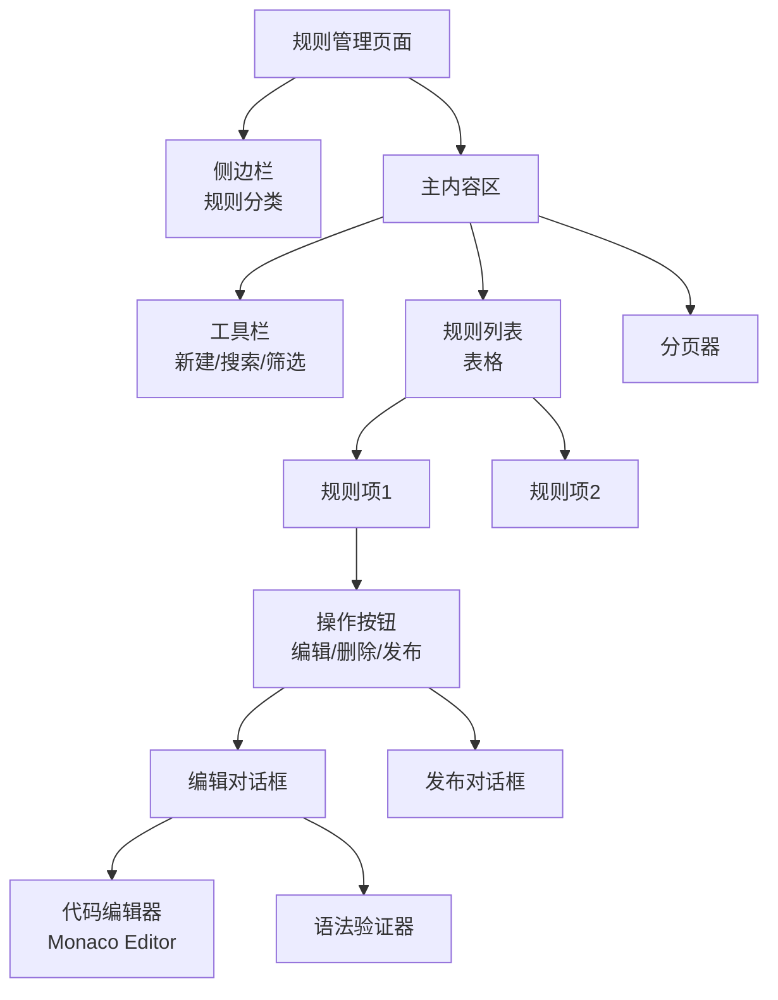
```mermaid
graph TB
    RulePage[规则管理页面]

    RulePage --> Sidebar[侧边栏<br/>规则分类]
    RulePage --> MainContent[主内容区]

    MainContent --> Toolbar[工具栏<br/>新建/搜索/筛选]
    MainContent --> RuleList[规则列表<br/>表格]
    MainContent --> Pagination[分页器]

    RuleList --> RuleItem1[规则项1]
    RuleList --> RuleItem2[规则项2]

    RuleItem1 --> Actions[操作按钮<br/>编辑/删除/发布]

    Actions --> EditDialog[编辑对话框]
    Actions --> PublishDialog[发布对话框]

    EditDialog --> Editor[代码编辑器<br/>Monaco Editor]
    EditDialog --> Validator[语法验证器]
```

**关键功能**：
1. 规则列表展示（支持分页、搜索、筛选）
2. 规则编辑器（语法高亮、自动补全）
3. 规则版本管理（版本历史、版本对比）
4. 规则发布（选择目标车辆、发布状态跟踪）

#### 3.3.2 日志展示页面

**页面组件结构**：

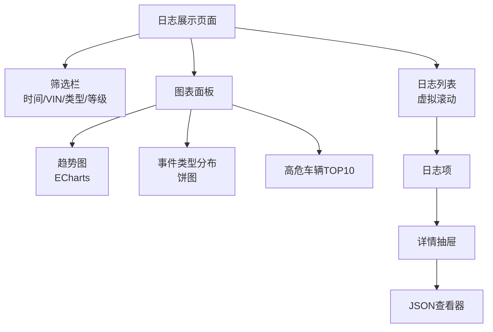
```mermaid
graph TB
    LogPage[日志展示页面]

    LogPage --> FilterBar[筛选栏<br/>时间/VIN/类型/等级]
    LogPage --> ChartPanel[图表面板]
    LogPage --> LogList[日志列表<br/>虚拟滚动]

    ChartPanel --> TrendChart[趋势图<br/>ECharts]
    ChartPanel --> PieChart[事件类型分布<br/>饼图]
    ChartPanel --> TopList[高危车辆TOP10]

    LogList --> LogItem[日志项]
    LogItem --> DetailDrawer[详情抽屉]

    DetailDrawer --> JSONViewer[JSON查看器]
```

**关键功能**：
1. 实时日志流（WebSocket推送）
2. 高级搜索（多条件组合查询）
3. 可视化统计（趋势图、分布图）
4. 日志详情（JSON格式化展示）
5. 导出功能（CSV、JSON）

#### 3.3.3 车辆管理页面

**页面组件结构**：

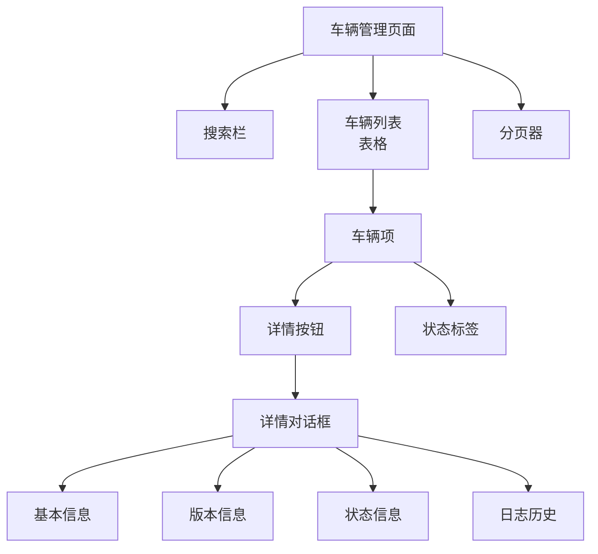
```mermaid
graph TB
    VehiclePage[车辆管理页面]

    VehiclePage --> SearchBar[搜索栏]
    VehiclePage --> VehicleList[车辆列表<br/>表格]
    VehiclePage --> Pagination[分页器]

    VehicleList --> VehicleItem[车辆项]
    VehicleItem --> DetailButton[详情按钮]
    VehicleItem --> StatusBadge[状态标签]

    DetailButton --> DetailDialog[详情对话框]

    DetailDialog --> BasicInfo[基本信息]
    DetailDialog --> VersionInfo[版本信息]
    DetailDialog --> StatusInfo[状态信息]
    DetailDialog --> LogHistory[日志历史]
```

**关键功能**：
1. 车辆列表展示（VIN、状态、最后心跳）
2. 车辆详情查看（设备信息、版本信息）
3. 车辆状态监控（在线/离线、资源占用）
4. 日志快速跳转

## 4. 通信协议设计

### 4.1 车云通信协议

#### 4.1.1 命令码定义

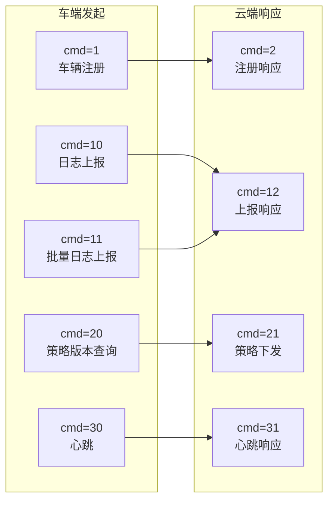
```mermaid
graph LR
    subgraph 车端发起
        C1[cmd=1<br/>车辆注册]
        C10[cmd=10<br/>日志上报]
        C11[cmd=11<br/>批量日志上报]
        C20[cmd=20<br/>策略版本查询]
        C30[cmd=30<br/>心跳]
    end

    subgraph 云端响应
        S2[cmd=2<br/>注册响应]
        S12[cmd=12<br/>上报响应]
        S21[cmd=21<br/>策略下发]
        S31[cmd=31<br/>心跳响应]
    end

    C1 --> S2
    C10 --> S12
    C11 --> S12
    C20 --> S21
    C30 --> S31
```

#### 4.1.2 消息格式

**通用请求头**：
```json
{
  "cmd": 1,
  "vin": "LSGBF53T1EW123456",
  "token": "eyJhbGciOiJIUzI1NiIs...",
  "timestamp": 1705208400,
  "nonce": "abc123",
  "signature": "HMAC-SHA256签名"
}
```

**通用响应格式**：
```json
{
  "code": 0,
  "message": "success",
  "data": {},
  "timestamp": 1705208400
}
```

#### 4.1.3 签名算法

```c
// HMAC-SHA256签名
char* generate_signature(const char* data, const char* secret) {
    unsigned char hmac[32];
    unsigned int hmac_len;

    HMAC(EVP_sha256(), secret, strlen(secret),
         (unsigned char*)data, strlen(data),
         hmac, &hmac_len);

    // Base64编码
    char* signature = malloc(64);
    base64_encode(hmac, hmac_len, signature);

    return signature;
}

// 签名验证
bool verify_signature(const char* data, const char* signature, const char* secret) {
    char* expected = generate_signature(data, secret);
    bool valid = (strcmp(expected, signature) == 0);
    free(expected);
    return valid;
}
```

### 4.2 车端内部通信协议

#### 4.2.1 TCP Socket协议

**消息格式**：

```
+--------+--------+----------+--------+
| Magic  | Length |   Type   |  Data  |
| 4字节  | 4字节  |  2字节   |  变长  |
+--------+--------+----------+--------+

Magic: 0x49445053 ("IDPS")
Length: Data长度（不含头部）
Type: 消息类型
Data: JSON格式数据
```

**消息类型定义**：

```c
enum message_type {
    MSG_REGISTER       = 1,   // 探针注册
    MSG_HEARTBEAT      = 2,   // 心跳
    MSG_LOG            = 10,  // 日志
    MSG_POLICY_UPDATE  = 20,  // 策略更新通知
    MSG_CONTROL        = 30,  // 控制命令
};
```

**消息编解码**：

```c
// 编码消息
int encode_message(uint16_t type, const char* data, char* buf, size_t buf_size) {
    uint32_t magic = 0x49445053;
    uint32_t length = strlen(data);

    if (12 + length > buf_size) {
        return -1;  // 缓冲区不足
    }

    // 写入头部
    memcpy(buf, &magic, 4);
    memcpy(buf + 4, &length, 4);
    memcpy(buf + 8, &type, 2);

    // 写入数据
    memcpy(buf + 12, data, length);

    return 12 + length;
}

// 解码消息
int decode_message(const char* buf, size_t buf_len,
                   uint16_t* type, char* data, size_t data_size) {
    if (buf_len < 12) {
        return -1;  // 数据不完整
    }

    // 读取头部
    uint32_t magic, length;
    memcpy(&magic, buf, 4);
    memcpy(&length, buf + 4, 4);
    memcpy(type, buf + 8, 2);

    // 验证magic
    if (magic != 0x49445053) {
        return -1;  // 无效消息
    }

    // 检查长度
    if (buf_len < 12 + length) {
        return 0;  // 数据未接收完整
    }

    if (length + 1 > data_size) {
        return -1;  // 缓冲区不足
    }

    // 读取数据
    memcpy(data, buf + 12, length);
    data[length] = '\0';

    return 12 + length;
}
```

## 5. 部署方案设计

### 5.1 车端部署

#### 5.1.1 目录结构

```
/opt/idps/
├── bin/
│   ├── idps-daemon          # 主守护进程
│   ├── network-probe        # 网络探针
│   ├── firewall-probe       # 防火墙探针
│   ├── host-probe           # 主机探针
│   └── suricata             # Suricata引擎
├── lib/
│   ├── libsuricata.so.7     # Suricata库
│   └── ...                  # 其他依赖库
├── etc/
│   ├── idps.conf            # 主配置文件
│   ├── suricata.yaml        # Suricata配置
│   └── rules/               # 规则目录
│       ├── builtin/         # 内置规则
│       ├── cloud/           # 云端规则
│       └── local/           # 本地规则
└── var/
    ├── log/                 # 日志目录
    ├── run/                 # 运行时文件（PID）
    └── cache/               # 缓存目录

/data/idps/
├── config/                  # 配置存储
│   ├── network_rules.enc    # 加密的网络规则
│   ├── firewall_policy.enc  # 加密的防火墙策略
│   └── host_audit_rules.enc # 加密的主机审计规则
├── certs/                   # 证书目录
│   ├── client.crt           # 客户端证书
│   ├── client.key           # 客户端私钥
│   └── ca.crt               # CA证书
└── cache/                   # 缓存目录
    └── logs/                # 离线日志缓存
```

#### 5.1.2 系统服务配置

**init.d服务脚本**（`/etc/init.d/idps`）：

```bash
#!/bin/sh
### BEGIN INIT INFO
# Provides:          idps
# Required-Start:    $network $remote_fs $syslog
# Required-Stop:     $network $remote_fs $syslog
# Default-Start:     2 3 4 5
# Default-Stop:      0 1 6
# Short-Description: IDPS Daemon
# Description:       Intrusion Detection and Prevention System
### END INIT INFO

DAEMON=/opt/idps/bin/idps-daemon
PIDFILE=/opt/idps/var/run/idps.pid
NAME=idps
DESC="IDPS Daemon"

case "$1" in
  start)
    echo "Starting $DESC"
    start-stop-daemon --start --quiet --pidfile $PIDFILE \
        --exec $DAEMON -- --config /opt/idps/etc/idps.conf
    ;;
  stop)
    echo "Stopping $DESC"
    start-stop-daemon --stop --quiet --pidfile $PIDFILE
    ;;
  restart)
    $0 stop
    sleep 2
    $0 start
    ;;
  status)
    if [ -f $PIDFILE ]; then
        PID=$(cat $PIDFILE)
        if kill -0 $PID 2>/dev/null; then
            echo "$DESC is running (PID $PID)"
        else
            echo "$DESC is not running (stale PID file)"
        fi
    else
        echo "$DESC is not running"
    fi
    ;;
  *)
    echo "Usage: $0 {start|stop|restart|status}"
    exit 1
    ;;
esac

exit 0
```

### 5.2 云端部署

#### 5.2.1 Kubernetes部署架构

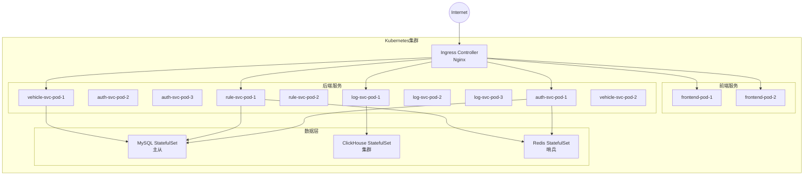
```mermaid
graph TB
    subgraph K8S["Kubernetes集群"]
        Ingress[Ingress Controller<br/>Nginx]

        subgraph Frontend["前端服务"]
            FE1[frontend-pod-1]
            FE2[frontend-pod-2]
        end

        subgraph Backend["后端服务"]
            Auth1[auth-svc-pod-1]
            Auth2[auth-svc-pod-2]
            Auth3[auth-svc-pod-3]

            Rule1[rule-svc-pod-1]
            Rule2[rule-svc-pod-2]

            Log1[log-svc-pod-1]
            Log2[log-svc-pod-2]
            Log3[log-svc-pod-3]

            Vehicle1[vehicle-svc-pod-1]
            Vehicle2[vehicle-svc-pod-2]
        end

        subgraph Database["数据层"]
            MySQL[MySQL StatefulSet<br/>主从]
            ClickHouse[ClickHouse StatefulSet<br/>集群]
            Redis[Redis StatefulSet<br/>哨兵]
        end
    end

    Internet((Internet)) --> Ingress

    Ingress --> FE1
    Ingress --> FE2
    Ingress --> Auth1
    Ingress --> Rule1
    Ingress --> Log1
    Ingress --> Vehicle1

    Auth1 --> MySQL
    Auth1 --> Redis
    Rule1 --> MySQL
    Rule1 --> Redis
    Vehicle1 --> MySQL
    Log1 --> ClickHouse
```

#### 5.2.2 Kubernetes配置示例

**Deployment配置**（log-service）：

```yaml
apiVersion: apps/v1
kind: Deployment
metadata:
  name: log-service
  namespace: idps
  labels:
    app: log-service
spec:
  replicas: 3
  selector:
    matchLabels:
      app: log-service
  template:
    metadata:
      labels:
        app: log-service
    spec:
      containers:
      - name: log-service
        image: idps/log-service:v1.2.3
        ports:
        - containerPort: 8080
          name: http
        env:
        - name: CLICKHOUSE_HOST
          value: "clickhouse-service"
        - name: CLICKHOUSE_PORT
          value: "9000"
        - name: REDIS_HOST
          value: "redis-service"
        - name: REDIS_PORT
          value: "6379"
        resources:
          requests:
            cpu: "500m"
            memory: "1Gi"
          limits:
            cpu: "2000m"
            memory: "4Gi"
        livenessProbe:
          httpGet:
            path: /health
            port: 8080
          initialDelaySeconds: 30
          periodSeconds: 10
        readinessProbe:
          httpGet:
            path: /ready
            port: 8080
          initialDelaySeconds: 10
          periodSeconds: 5
---
apiVersion: v1
kind: Service
metadata:
  name: log-service
  namespace: idps
spec:
  selector:
    app: log-service
  ports:
  - protocol: TCP
    port: 80
    targetPort: 8080
  type: ClusterIP
```

**Ingress配置**：

```yaml
apiVersion: networking.k8s.io/v1
kind: Ingress
metadata:
  name: idps-ingress
  namespace: idps
  annotations:
    nginx.ingress.kubernetes.io/ssl-redirect: "true"
    nginx.ingress.kubernetes.io/backend-protocol: "HTTP"
spec:
  tls:
  - hosts:
    - vsoc.example.com
    secretName: idps-tls-secret
  rules:
  - host: vsoc.example.com
    http:
      paths:
      - path: /
        pathType: Prefix
        backend:
          service:
            name: frontend-service
            port:
              number: 80
      - path: /api/v1/auth
        pathType: Prefix
        backend:
          service:
            name: auth-service
            port:
              number: 80
      - path: /api/v1/rule
        pathType: Prefix
        backend:
          service:
            name: rule-service
            port:
              number: 80
      - path: /api/v1/log
        pathType: Prefix
        backend:
          service:
            name: log-service
            port:
              number: 80
      - path: /api/v1/vehicle
        pathType: Prefix
        backend:
          service:
            name: vehicle-service
            port:
              number: 80
```

## 6. 安全设计

### 6.1 通信安全

#### 6.1.1 TLS双向认证

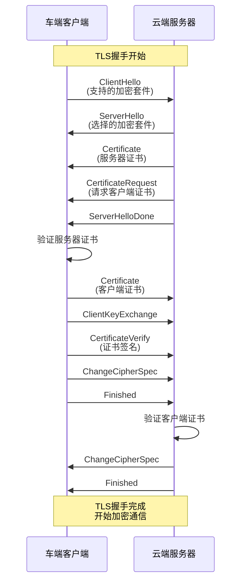
```mermaid
sequenceDiagram
    participant C as 车端客户端
    participant S as 云端服务器

    Note over C,S: TLS握手开始

    C->>S: ClientHello<br/>(支持的加密套件)
    S->>C: ServerHello<br/>(选择的加密套件)
    S->>C: Certificate<br/>(服务器证书)
    S->>C: CertificateRequest<br/>(请求客户端证书)
    S->>C: ServerHelloDone

    C->>C: 验证服务器证书

    C->>S: Certificate<br/>(客户端证书)
    C->>S: ClientKeyExchange
    C->>S: CertificateVerify<br/>(证书签名)
    C->>S: ChangeCipherSpec
    C->>S: Finished

    S->>S: 验证客户端证书

    S->>C: ChangeCipherSpec
    S->>C: Finished

    Note over C,S: TLS握手完成<br/>开始加密通信
```

**OpenSSL配置**（车端）：

```c
SSL_CTX* create_ssl_context() {
    const SSL_METHOD* method = TLS_client_method();
    SSL_CTX* ctx = SSL_CTX_new(method);

    // 设置TLS版本
    SSL_CTX_set_min_proto_version(ctx, TLS1_2_VERSION);

    // 加载CA证书
    SSL_CTX_load_verify_locations(ctx, "/data/idps/certs/ca.crt", NULL);

    // 加载客户端证书和私钥
    SSL_CTX_use_certificate_file(ctx, "/data/idps/certs/client.crt", SSL_FILETYPE_PEM);
    SSL_CTX_use_PrivateKey_file(ctx, "/data/idps/certs/client.key", SSL_FILETYPE_PEM);

    // 验证私钥
    if (!SSL_CTX_check_private_key(ctx)) {
        log_error("Private key does not match certificate");
        SSL_CTX_free(ctx);
        return NULL;
    }

    // 设置验证模式
    SSL_CTX_set_verify(ctx, SSL_VERIFY_PEER | SSL_VERIFY_FAIL_IF_NO_PEER_CERT, NULL);

    // 设置加密套件（仅允许强加密）
    SSL_CTX_set_cipher_list(ctx, "ECDHE-RSA-AES256-GCM-SHA384:ECDHE-RSA-AES128-GCM-SHA256");

    return ctx;
}
```

### 6.2 数据加密

#### 6.2.1 配置文件加密

```c
// AES-256-GCM加密
int aes_gcm_encrypt(const unsigned char* plaintext, int plaintext_len,
                    const unsigned char* key, const unsigned char* iv,
                    unsigned char* ciphertext, unsigned char* tag) {
    EVP_CIPHER_CTX* ctx = EVP_CIPHER_CTX_new();
    int len, ciphertext_len;

    // 初始化加密
    EVP_EncryptInit_ex(ctx, EVP_aes_256_gcm(), NULL, key, iv);

    // 加密
    EVP_EncryptUpdate(ctx, ciphertext, &len, plaintext, plaintext_len);
    ciphertext_len = len;

    // 完成加密
    EVP_EncryptFinal_ex(ctx, ciphertext + len, &len);
    ciphertext_len += len;

    // 获取tag
    EVP_CIPHER_CTX_ctrl(ctx, EVP_CTRL_GCM_GET_TAG, 16, tag);

    EVP_CIPHER_CTX_free(ctx);
    return ciphertext_len;
}

// AES-256-GCM解密
int aes_gcm_decrypt(const unsigned char* ciphertext, int ciphertext_len,
                    const unsigned char* tag, const unsigned char* key,
                    const unsigned char* iv, unsigned char* plaintext) {
    EVP_CIPHER_CTX* ctx = EVP_CIPHER_CTX_new();
    int len, plaintext_len, ret;

    // 初始化解密
    EVP_DecryptInit_ex(ctx, EVP_aes_256_gcm(), NULL, key, iv);

    // 解密
    EVP_DecryptUpdate(ctx, plaintext, &len, ciphertext, ciphertext_len);
    plaintext_len = len;

    // 设置tag
    EVP_CIPHER_CTX_ctrl(ctx, EVP_CTRL_GCM_SET_TAG, 16, (void*)tag);

    // 完成解密并验证tag
    ret = EVP_DecryptFinal_ex(ctx, plaintext + len, &len);

    EVP_CIPHER_CTX_free(ctx);

    if (ret > 0) {
        plaintext_len += len;
        return plaintext_len;
    } else {
        return -1;  // tag验证失败
    }
}
```

## 7. 性能优化设计

### 7.1 车端性能优化

**1. 内存优化**：
- 使用内存池减少频繁malloc/free
- 日志缓冲区循环复用
- 限制连接跟踪表大小（LRU淘汰）

**2. CPU优化**：
- 使用eBPF/XDP减少内核态-用户态切换
- 多线程处理（epoll + 线程池）
- 避免不必要的数据拷贝（零拷贝技术）

**3. 网络优化**：
- 批量日志上报减少HTTP请求次数
- 使用gzip压缩减少流量
- 连接复用（HTTP Keep-Alive）

### 7.2 云端性能优化

**1. 数据库优化**：
- ClickHouse分区表（按月分区）
- MySQL索引优化
- Redis缓存热点数据

**2. API优化**：
- 接口限流（令牌桶算法）
- 请求去重
- 响应缓存

**3. 水平扩展**：
- 无状态服务设计（易于扩容）
- 数据库读写分离
- CDN加速静态资源

---

**文档结束**
