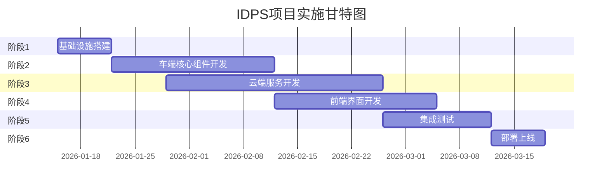

# 车辆入侵检测系统（IDPS）实施计划

## 文档信息

| 项目 | 内容 |
|------|------|
| 文档编号 | IDPS-IMPL-PLAN-0003 |
| 文档版本 | v1.1 |
| 创建日期 | 2026-01-14 |
| 更新日期 | 2026-01-14 |
| 文档状态 | 草案 |
| 项目名称 | 车辆入侵检测系统实施计划 |
| 变更说明 | v1.1: 云端部署从Kubernetes改为Docker Compose，后端语言从Go改为Python |

## 1. 项目概述

### 1.1 项目目标

开发一套完整的车辆入侵检测系统（IDPS），包括车端检测组件和云端管理平台，实现对车辆网络、防火墙和主机层面的入侵检测与防护。

### 1.2 交付物

- **车端组件**：
  - 车云交互组件（C语言实现）
  - 网络入侵检测引擎探针（C语言实现）
  - 防火墙探针（C语言 + eBPF实现）
  - 主机入侵检测探针（C语言实现）

- **云端平台**：
  - 认证服务（Python语言实现）
  - 规则服务（Python语言实现）
  - 日志服务（Python语言实现）
  - 车辆管理服务（Python语言实现）
  - 前端管理系统（Typescript/Vite/Tailwind/Shadcn实现）

- **配套文档**：
  - API接口文档
  - 部署手册
  - 运维手册
  - 用户手册

### 1.3 技术栈

#### 车端技术栈
- **开发语言**：C（C11标准）
- **构建工具**：CMake 3.15+
- **核心依赖**：
  - OpenSSL 1.1.1+ (TLS/加密)
  - libjansson (JSON处理)
  - libbpf (eBPF编程)
  - Suricata 7.0+ (IDS引擎)
- **系统要求**：Linux 5.10+, ARM64架构

#### 云端技术栈
- **后端语言**：Python 3.11+
- **Web框架**：Flask 3.0+ / FastAPI 0.100+
- **WSGI服务器**：Gunicorn
- **数据库**：
  - MySQL 8.0+ (关系数据)
  - ClickHouse 23.8+ (日志存储)
  - Redis 7.0+ (缓存)
- **ORM框架**：SQLAlchemy 2.0+
- **前端框架**：
  - React 18+
  - TypeScript 5.0+
  - Ant Design 5.0+
  - ECharts 5.0+ (图表)
- **容器部署**：Docker + Docker Compose
- **CI/CD**：GitLab CI

## 2. 实施阶段规划

### 2.1 阶段划分

项目分为6个阶段，预计总开发周期根据团队规模而定：



### 2.2 里程碑

| 里程碑 | 交付物 | 目标日期 |
|--------|--------|----------|
| M1 | 开发环境搭建完成 | 第1周末 |
| M2 | 车端框架完成 | 第3周末 |
| M3 | 云端API服务完成 | 第6周末 |
| M4 | 前端界面完成 | 第8周末 |
| M5 | 集成测试完成 | 第10周末 |
| M6 | 生产环境部署完成 | 第11周末 |

## 3. 阶段1：基础设施搭建（第1周）

### 3.1 开发环境准备

#### 3.1.1 车端开发环境
**负责人**：车端团队负责人

**任务清单**：
- [ ] 准备ARM64交叉编译工具链
  - 安装aarch64-linux-gnu-gcc
  - 配置CMake工具链文件
  - 验证编译环境
- [ ] 搭建车端开发虚拟机/容器
  - QEMU模拟ARM64环境
  - 或使用ARM64开发板（如树莓派4）
- [ ] 安装车端依赖库
  - OpenSSL开发包
  - libjansson开发包
  - libbpf开发包
  - 内核头文件（用于eBPF开发）
- [ ] 配置Suricata开发环境
  - 编译Suricata 7.0
  - 熟悉Suricata配置和规则格式
- [ ] 搭建版本控制
  - 创建Git仓库：idps-vehicle
  - 配置.gitignore
  - 设置分支策略（main/develop/feature）

**输出**：
- 车端开发环境文档
- 编译脚本和Makefile

#### 3.1.2 云端开发环境
**负责人**：云端团队负责人

**任务清单**：
- [ ] 搭建本地开发环境
  - 安装Docker Desktop
  - 配置本地Docker Compose环境
- [ ] 安装开发工具
  - Python 3.11+
  - pip/poetry（依赖管理）
  - Node.js 20+ & npm/pnpm
  - MySQL 8.0
  - ClickHouse 23.8
  - Redis 7.0
- [ ] 配置IDE和开发工具
  - VSCode + Python插件
  - PyCharm（可选）
  - VSCode + TypeScript插件
  - Postman（API测试）
  - DBeaver（数据库管理）
- [ ] 搭建版本控制
  - 创建Git仓库：idps-cloud
  - 创建Git仓库：idps-frontend
  - 配置pre-commit hooks（black、flake8、mypy）

**输出**：
- 云端开发环境文档
- Docker Compose开发配置文件

### 3.2 CI/CD流水线搭建

**负责人**：DevOps工程师

**任务清单**：
- [ ] 配置GitLab CI/CD
  - 车端项目Pipeline配置
  - 云端项目Pipeline配置
  - 前端项目Pipeline配置
- [ ] 搭建容器镜像仓库
  - Harbor或GitLab Container Registry
  - 配置镜像扫描
- [ ] 配置自动化测试
  - 单元测试自动执行
  - 代码覆盖率报告
  - 静态代码分析（SonarQube）

**输出**：
- CI/CD流水线配置文件
- 构建和部署脚本

### 3.3 测试环境搭建

**负责人**：测试工程师

**任务清单**：
- [ ] 搭建测试环境
  - 使用Docker Compose搭建测试环境
  - 或使用独立测试服务器
- [ ] 部署测试数据库
  - MySQL单机
  - ClickHouse单机
  - Redis单机
- [ ] 配置测试数据
  - 初始化数据库表结构
  - 准备测试数据集
- [ ] 搭建测试车辆模拟器
  - 模拟车端环境
  - 模拟网络流量生成

**输出**：
- 测试环境部署文档
- 测试数据准备脚本

## 4. 阶段2：车端核心组件开发（第2-4周）

### 4.1 公共库开发（第2周）

**负责人**：车端架构师

**任务清单**：
- [ ] 日志模块（logging.c/h）
  - 支持多级别日志（DEBUG/INFO/WARN/ERROR）
  - 支持日志轮转
  - 支持异步写入
- [ ] 配置管理模块（config.c/h）
  - JSON配置文件解析
  - 配置热加载
  - 配置加密/解密
- [ ] 网络通信模块（network.c/h）
  - HTTP/HTTPS客户端（基于libcurl）
  - TLS双向认证
  - 连接池管理
- [ ] 加密模块（crypto.c/h）
  - AES-256-GCM加密/解密
  - SHA256哈希
  - HMAC-SHA256签名
  - RSA签名验证
- [ ] 工具函数库（utils.c/h）
  - UUID生成
  - Base64编解码
  - 时间处理
  - 字符串处理

**测试要求**：
- 每个模块编写单元测试
- 代码覆盖率≥80%

**输出**：
- 公共库源代码
- 单元测试代码
- API文档

### 4.2 车云交互组件开发（第2-3周）

#### 4.2.1 TCP服务器实现
**负责人**：车端核心开发工程师A

**任务清单**：
- [ ] epoll事件循环实现（tcp_server.c）
  - 监听端口绑定
  - 连接接受
  - 事件分发（EPOLLIN/EPOLLOUT/EPOLLERR）
- [ ] 连接管理（connection.c）
  - 连接上下文结构体
  - 连接状态机
  - 连接超时检测
- [ ] 消息编解码（protocol.c）
  - 消息格式编码/解码
  - 消息完整性校验
- [ ] 消息路由（router.c）
  - 根据消息类型分发
  - 支持回调注册

**测试要求**：
- 压力测试：支持≥10个并发连接
- 性能测试：消息吞吐量≥1000 msg/s

#### 4.2.2 云端通信模块实现
**负责人**：车端核心开发工程师B

**任务清单**：
- [ ] 注册认证模块（auth.c）
  - 设备指纹生成
  - 注册请求构造
  - Token管理（保存、更新、过期检测）
- [ ] 策略同步模块（policy_sync.c）
  - 定时查询云端规则版本
  - 规则下载
  - 规则校验（checksum、签名）
  - 规则本地加密存储
- [ ] 日志上报模块（log_upload.c）
  - 日志收集队列
  - 日志去重
  - 批量上报
  - gzip压缩
  - 离线缓存
- [ ] 心跳模块（heartbeat.c）
  - 定时心跳发送
  - 网络状态监测

**测试要求**：
- 功能测试：验证所有API交互
- 异常测试：网络断开、服务器错误

**输出**：
- 车云交互组件源代码
- 集成测试用例

### 4.3 网络入侵检测引擎探针开发（第2-3周）

**负责人**：车端核心开发工程师C

**任务清单**：
- [ ] Suricata进程管理（suricata_manager.c）
  - 启动/停止Suricata进程
  - 进程监控和自动重启
  - 配置文件生成
- [ ] 规则管理器（rule_manager.c）
  - 规则文件加载
  - 规则热加载（SIGUSR2信号）
  - 规则版本管理
- [ ] EVE日志解析器（eve_parser.c）
  - inotify监控eve.json文件
  - JSON日志解析
  - alert事件提取
- [ ] 日志转发器（log_forwarder.c）
  - 转发日志到车云交互组件
  - TCP Socket通信

**测试要求**：
- 功能测试：验证Suricata正常启动和规则加载
- 性能测试：日志解析延迟<100ms

**输出**：
- 网络探针源代码
- Suricata集成测试用例

### 4.4 防火墙探针开发（第3-4周）

**负责人**：车端eBPF专家

**任务清单**：
- [ ] eBPF/XDP程序开发（xdp_firewall.c）
  - XDP包过滤程序
  - BPF Maps定义（规则表、连接跟踪表、统计表）
  - 规则匹配逻辑
- [ ] 用户态控制程序（firewall_control.c）
  - BPF程序加载和附加
  - 规则管理API（添加、删除、更新）
  - 连接跟踪数据读取
  - 统计数据读取
- [ ] 端口扫描检测（port_scan_detector.c）
  - 访问频率统计
  - 阈值检测
  - 告警生成
- [ ] ARP监控（arp_monitor.c）
  - ARP包捕获
  - ARP欺骗检测

**测试要求**：
- 功能测试：验证包过滤和连接跟踪
- 性能测试：XDP性能损耗<5%

**输出**：
- 防火墙探针源代码
- eBPF程序测试用例

### 4.5 主机入侵检测探针开发（第3-4周）

**负责人**：车端核心开发工程师D

**任务清单**：
- [ ] Audit监控模块（audit_monitor.c）
  - audit日志读取
  - 系统调用过滤
  - 命令执行过滤
  - 规则匹配
- [ ] 文件监控模块（file_monitor.c）
  - inotify事件监控
  - 文件哈希计算
  - 敏感路径监控
- [ ] 进程监控模块（process_monitor.c）
  - /proc目录扫描
  - 进程信息收集
  - 异常进程检测
- [ ] Root检测模块（root_detector.c）
  - su二进制检测
  - root应用检测
  - 系统属性检测
  - SELinux状态检测
- [ ] 性能监控模块（perf_monitor.c）
  - CPU使用率采集
  - 内存使用率采集
  - 磁盘使用率采集
  - IOPS统计

**测试要求**：
- 功能测试：验证各类检测功能
- 性能测试：CPU占用<2%

**输出**：
- 主机探针源代码
- 检测功能测试用例

### 4.6 车端主控程序开发（第4周）

**负责人**：车端架构师

**任务清单**：
- [ ] 主守护进程（idps_daemon.c）
  - 进程初始化
  - 组件启动和管理
  - 信号处理（SIGTERM/SIGINT/SIGHUP）
  - 优雅退出
- [ ] 配置文件解析
  - 主配置文件加载
  - 配置项验证
- [ ] 服务注册脚本
  - init.d脚本编写
  - 开机自启动配置

**输出**：
- 车端主控程序
- 部署脚本

## 5. 阶段3：云端服务开发（第2-7周）

### 5.1 数据库设计与实施（第2周）

**负责人**：数据库工程师

**任务清单**：
- [ ] MySQL数据库设计
  - 创建数据库和表结构
  - 创建索引
  - 编写初始化SQL脚本
- [ ] ClickHouse数据库设计
  - 创建日志表和性能表
  - 配置分区策略
  - 配置TTL规则
- [ ] Redis配置
  - 配置哨兵模式
  - 设置缓存策略
- [ ] 数据库迁移工具
  - 使用Alembic工具
  - 编写版本化迁移脚本

**输出**：
- 数据库初始化脚本
- 数据库迁移脚本
- ER图文档

### 5.2 公共库和中间件开发（第2-3周）

**负责人**：云端架构师

**任务清单**：
- [ ] Flask应用框架搭建
  - Flask应用工厂模式
  - Blueprint路由组织
  - 配置管理（开发/测试/生产）
- [ ] Flask中间件开发
  - 认证中间件（JWT验证装饰器）
  - 日志中间件（请求日志记录）
  - 限流中间件（Flask-Limiter）
  - CORS中间件（Flask-CORS）
  - 错误处理中间件
- [ ] 数据库ORM封装
  - SQLAlchemy模型定义
  - MySQL连接池配置
  - ClickHouse客户端封装（clickhouse-driver）
  - Redis客户端封装（redis-py）
  - 数据库迁移工具（Alembic）
- [ ] 工具库
  - 加密工具（cryptography库）
    - AES-256-GCM加密/解密
    - SHA256哈希
    - HMAC-SHA256签名
  - JWT工具（PyJWT）
  - 时间工具（datetime、pytz）
  - 字符串工具
  - 配置管理（python-dotenv）
- [ ] 响应格式统一
  - 统一响应装饰器
  - 错误码定义（枚举类）
  - 异常处理基类

**输出**：
- 公共库源代码（Python包）
- 中间件文档
- 单元测试代码

### 5.3 认证服务开发（第3-4周）

**负责人**：云端开发工程师A

**任务清单**：
- [ ] API实现
  - POST /api/v1/vehicle/register（车辆注册）
  - POST /api/v1/auth/refresh（Token刷新）
  - POST /api/v1/vehicle/heartbeat（心跳）
- [ ] 业务逻辑
  - VIN合法性验证
  - 设备指纹验证
  - 客户端证书验证
  - JWT Token生成和验证
  - 心跳时间更新
- [ ] 数据访问层
  - 车辆信息CRUD
  - Token缓存（Redis）
- [ ] 单元测试
  - 业务逻辑测试
  - API集成测试

**输出**：
- 认证服务源代码
- API测试用例

### 5.4 规则服务开发（第4-5周）

**负责人**：云端开发工程师B

**任务清单**：
- [ ] API实现
  - POST /api/v1/rule/query（查询规则版本）
  - GET /api/v1/rule/download（下载规则）
  - POST /api/v1/rule/version（创建规则版本）
  - POST /api/v1/rule/publish（发布规则）
- [ ] 业务逻辑
  - 规则版本管理
  - 规则文件上传和存储
  - 规则签名生成
  - 规则发布管理
- [ ] 数据访问层
  - 规则版本CRUD
  - 规则下发记录CRUD
- [ ] 文件存储
  - 对象存储集成（MinIO或S3）
  - 文件URL生成

**输出**：
- 规则服务源代码
- API测试用例

### 5.5 日志服务开发（第5-6周）

**负责人**：云端开发工程师C

**任务清单**：
- [ ] API实现
  - POST /api/v1/log/upload（上报日志）
  - POST /api/v1/log/batch（批量上报）
  - GET /api/v1/log/query（查询日志）
  - GET /api/v1/log/stats（日志统计）
- [ ] 业务逻辑
  - 日志接收和验证
  - 日志去重检测
  - 批量插入ClickHouse
  - 日志查询和过滤
  - 统计分析
- [ ] 数据访问层
  - ClickHouse批量写入
  - ClickHouse复杂查询
- [ ] 性能优化
  - 批量插入缓冲
  - 查询结果缓存
  - 分页优化

**输出**：
- 日志服务源代码
- 性能测试报告

### 5.6 车辆管理服务开发（第6周）

**负责人**：云端开发工程师D

**任务清单**：
- [ ] API实现
  - GET /api/v1/vehicle/list（车辆列表）
  - GET /api/v1/vehicle/:vin（车辆详情）
  - PUT /api/v1/vehicle/:vin（更新车辆）
  - DELETE /api/v1/vehicle/:vin（删除车辆）
- [ ] 业务逻辑
  - 车辆信息管理
  - 车辆状态监控
  - 在线/离线判断
- [ ] 数据访问层
  - 车辆信息CRUD

**输出**：
- 车辆管理服务源代码
- API测试用例

### 5.7 API网关配置（第7周）

**负责人**：云端架构师

**任务清单**：
- [ ] Kubernetes Ingress配置
  - 路由规则配置
  - TLS证书配置
  - 负载均衡配置
- [ ] API文档生成
  - Swagger/OpenAPI规范
  - API文档自动生成

**输出**：
- Ingress配置文件
- API文档

## 6. 阶段4：前端界面开发（第4-7周）

### 6.1 前端脚手架搭建（第4周）

**负责人**：前端架构师

**任务清单**：
- [ ] 项目初始化
  - 使用Create React App或Vite创建项目
  - 配置TypeScript
  - 配置ESLint和Prettier
- [ ] 路由配置
  - React Router配置
  - 路由守卫（认证检查）
- [ ] 状态管理
  - Redux Toolkit或Zustand配置
- [ ] UI框架集成
  - Ant Design安装和配置
  - 主题定制
- [ ] HTTP客户端封装
  - Axios封装
  - 请求拦截器（添加Token）
  - 响应拦截器（错误处理）

**输出**：
- 前端项目脚手架
- 开发规范文档

### 6.2 公共组件开发（第4周）

**负责人**：前端核心开发工程师A

**任务清单**：
- [ ] 布局组件
  - 顶部导航栏
  - 侧边栏菜单
  - 面包屑导航
- [ ] 通用组件
  - 数据表格（支持分页、排序、筛选）
  - 搜索框
  - 日期范围选择器
  - 状态标签
- [ ] 图表组件
  - ECharts封装
  - 趋势图组件
  - 饼图组件
  - 柱状图组件

**输出**：
- 公共组件库
- 组件Storybook文档

### 6.3 规则管理页面开发（第5周）

**负责人**：前端核心开发工程师B

**任务清单**：
- [ ] 规则列表页
  - 规则列表展示
  - 分页、搜索、筛选
  - 规则版本管理
- [ ] 规则编辑器
  - Monaco Editor集成
  - 语法高亮
  - 自动补全
  - 语法验证
- [ ] 规则发布对话框
  - 目标车辆选择
  - 发布确认
  - 发布状态跟踪

**输出**：
- 规则管理页面源代码

### 6.4 日志展示页面开发（第6周）

**负责人**：前端核心开发工程师C

**任务清单**：
- [ ] 日志列表页
  - 日志列表展示（虚拟滚动）
  - 高级搜索
  - 多条件筛选
  - 导出功能
- [ ] 日志详情抽屉
  - JSON格式化展示
  - 字段高亮
- [ ] 可视化统计
  - 日志趋势图
  - 事件类型分布饼图
  - 高危车辆TOP10列表
- [ ] 实时日志流
  - WebSocket连接
  - 实时日志推送

**输出**：
- 日志展示页面源代码

### 6.5 车辆管理页面开发（第7周）

**负责人**：前端核心开发工程师D

**任务清单**：
- [ ] 车辆列表页
  - 车辆列表展示
  - 搜索和筛选
  - 在线/离线状态显示
- [ ] 车辆详情对话框
  - 基本信息展示
  - 版本信息展示
  - 状态监控
  - 日志快速跳转

**输出**：
- 车辆管理页面源代码

### 6.6 用户管理和登录页面（第7周）

**负责人**：前端架构师

**任务清单**：
- [ ] 登录页面
  - 用户名密码登录
  - Token保存
  - 登录状态持久化
- [ ] 用户管理页面
  - 用户列表
  - 添加/编辑用户
  - 角色管理

**输出**：
- 用户管理页面源代码

## 7. 阶段5：集成测试（第8-9周）

### 7.1 单元测试（持续进行）

**负责人**：各模块开发负责人

**要求**：
- 车端C代码使用CUnit或Check框架
- 云端Python代码使用pytest框架
- 前端使用Jest和React Testing Library
- 代码覆盖率≥80%

### 7.2 集成测试（第8周）

**负责人**：测试工程师

**任务清单**：
- [ ] 车端集成测试
  - 测试车云交互组件与各探针的通信
  - 测试各探针的日志上报
  - 测试策略热加载
- [ ] 云端集成测试
  - 测试各服务间API调用
  - 测试数据库读写
  - 测试缓存机制
- [ ] 端到端测试
  - 测试车辆注册流程
  - 测试规则下发流程
  - 测试日志上报和查询流程

**输出**：
- 集成测试报告
- 问题跟踪列表

### 7.3 性能测试（第9周）

**负责人**：性能测试工程师

**任务清单**：
- [ ] 车端性能测试
  - CPU占用率测试（目标：<5%）
  - 内存占用测试（目标：<100MB）
  - 网络流量测试
  - 日志处理延迟测试（目标：<100ms）
- [ ] 云端性能测试
  - API响应时间测试（目标：P95<500ms）
  - 并发请求测试（目标：支持1000 QPS）
  - 数据库压力测试
  - 日志写入吞吐量测试（目标：10000条/秒）

**输出**：
- 性能测试报告
- 性能优化建议

### 7.4 安全测试（第9周）

**负责人**：安全测试工程师

**任务清单**：
- [ ] 渗透测试
  - API安全测试（SQL注入、XSS等）
  - 认证授权测试
  - 会话管理测试
- [ ] 代码审计
  - 静态代码分析（SonarQube）
  - 依赖漏洞扫描
- [ ] 合规性检查
  - GPL许可证隔离验证
  - 数据加密验证
  - TLS配置验证

**输出**：
- 安全测试报告
- 漏洞修复跟踪

## 8. 阶段6：部署上线（第10-11周）

### 8.1 生产环境准备（第10周）

**负责人**：DevOps工程师

**任务清单**：
- [ ] 生产服务器准备
  - 准备生产服务器（物理机或云主机）
  - 安装Docker Engine和Docker Compose
  - 配置系统防火墙规则
  - 配置系统资源限制
- [ ] 数据库部署
  - MySQL单机或主从部署
  - ClickHouse单机或集群部署
  - Redis单机或哨兵部署
  - 数据库备份策略配置
- [ ] 监控系统部署
  - Prometheus + Grafana部署（Docker容器）
  - 配置告警规则
  - cAdvisor容器监控
- [ ] 日志收集系统
  - Docker日志驱动配置
  - 日志轮转配置
  - 可选：ELK或Loki部署

**输出**：
- 生产环境部署文档
- 运维手册

### 8.2 云端服务部署（第10周）

**负责人**：DevOps工程师

**任务清单**：
- [ ] 构建Docker镜像
  - 各Python微服务镜像构建
  - 前端镜像构建
  - 镜像推送到镜像仓库（Harbor或Docker Hub）
- [ ] 配置环境变量
  - 创建.env文件
  - 配置数据库连接信息
  - 配置JWT密钥等敏感信息
- [ ] 部署Docker Compose
  - 上传docker compose.yml和相关配置
  - 配置数据卷挂载
  - 启动所有服务
  - 验证服务健康状态
- [ ] 配置域名和SSL证书
  - DNS配置
  - Let's Encrypt证书申请（或使用现有证书）
  - Nginx SSL配置
- [ ] 配置反向代理
  - Nginx配置优化
  - 启用HTTPS和HTTP/2
  - 配置TLS双向认证

**输出**：
- Docker Compose生产配置文件
- 部署脚本
- 服务启动和停止脚本

### 8.3 车端软件发布（第11周）

**负责人**：车端团队负责人

**任务清单**：
- [ ] 车端软件打包
  - 编译ARM64二进制
  - 创建安装包（deb或rpm）
  - 生成校验和和签名
- [ ] OTA更新准备
  - 上传安装包到OTA服务器
  - 配置更新策略
- [ ] 车辆软件部署
  - 分批部署策略
  - 部署监控和回滚准备

**输出**：
- 车端安装包
- OTA更新配置

### 8.4 上线验证（第11周）

**负责人**：测试工程师 + DevOps工程师

**任务清单**：
- [ ] 冒烟测试
  - 验证关键功能可用
  - 验证数据链路畅通
- [ ] 灰度发布
  - 选择少量车辆先行部署
  - 监控运行状态
  - 收集反馈
- [ ] 全量发布
  - 逐步扩大部署范围
  - 持续监控

**输出**：
- 上线验证报告
- 问题跟踪列表

## 9. 文档交付

### 9.1 技术文档

**负责人**：技术文档工程师

**任务清单**：
- [ ] API接口文档
  - Swagger/OpenAPI规范
  - 请求响应示例
- [ ] 数据库设计文档
  - ER图
  - 表结构说明
- [ ] 架构设计文档
  - 系统架构图
  - 组件交互图
- [ ] 部署手册
  - 车端部署步骤
  - 云端部署步骤
  - 配置说明

### 9.2 运维文档

**负责人**：DevOps工程师

**任务清单**：
- [ ] 运维手册
  - 日常运维操作
  - 故障排查指南
  - 监控告警处理
- [ ] 备份恢复手册
  - 数据库备份策略
  - 灾难恢复流程

### 9.3 用户文档

**负责人**：产品经理 + 技术文档工程师

**任务清单**：
- [ ] 用户手册
  - 功能介绍
  - 操作指南
  - FAQ
- [ ] 快速开始指南
  - 车辆注册
  - 规则配置
  - 日志查看

## 10. 风险管理

### 10.1 技术风险

| 风险 | 影响 | 概率 | 缓解措施 |
|------|------|------|----------|
| eBPF兼容性问题 | 高 | 中 | 提前验证目标内核版本，准备降级方案 |
| Suricata性能瓶颈 | 中 | 中 | 提前性能测试，优化规则集 |
| ClickHouse写入性能 | 高 | 低 | 批量写入，分区优化 |
| GPL许可证传染 | 高 | 低 | 严格进程隔离，代码审查 |

### 10.2 资源风险

| 风险 | 影响 | 概率 | 缓解措施 |
|------|------|------|----------|
| 开发人员不足 | 高 | 中 | 及时招聘，外包支持 |
| 测试环境资源不足 | 中 | 低 | 使用云资源，按需扩展 |
| 车端测试车辆不足 | 中 | 中 | 使用虚拟机模拟，申请更多测试车 |

### 10.3 进度风险

| 风险 | 影响 | 概率 | 缓解措施 |
|------|------|------|----------|
| 需求变更 | 高 | 中 | 需求冻结，版本迭代 |
| 技术难点攻关时间超预期 | 高 | 中 | 提前技术预研，准备备选方案 |
| 测试问题修复时间长 | 中 | 中 | 增加测试轮次，提前介入测试 |

## 11. 质量保证

### 11.1 代码质量

- **代码审查**：所有代码必须经过至少1人审查才能合并
- **静态分析**：使用SonarQube进行静态代码分析
- **单元测试**：代码覆盖率≥80%
- **编码规范**：
  - C代码遵循Linux内核编码规范
  - Python代码遵循PEP 8规范，使用black格式化，flake8检查，mypy类型检查
  - TypeScript代码遵循Airbnb规范

### 11.2 测试质量

- **测试策略**：单元测试 + 集成测试 + 端到端测试
- **自动化测试**：集成到CI/CD流水线
- **性能测试**：每个迭代进行性能回归测试
- **安全测试**：上线前必须通过安全测试

### 11.3 文档质量

- **及时性**：代码和文档同步更新
- **完整性**：覆盖所有模块和接口
- **准确性**：定期审查和更新文档

## 12. 团队组织

### 12.1 团队结构

```
项目经理
├── 车端团队（6人）
│   ├── 车端架构师（1人）
│   ├── 核心开发工程师（4人）
│   └── eBPF专家（1人）
├── 云端团队（8人）
│   ├── 云端架构师（1人）
│   ├── 后端开发工程师（4人）
│   ├── 前端架构师（1人）
│   └── 前端开发工程师（2人）
├── 测试团队（3人）
│   ├── 测试工程师（2人）
│   └── 性能/安全测试工程师（1人）
├── DevOps团队（2人）
│   └── DevOps工程师（2人）
└── 支持团队（2人）
    ├── 数据库工程师（1人）
    └── 技术文档工程师（1人）
```

### 12.2 沟通机制

- **每日站会**：每天上午10:00，15分钟
- **周会**：每周五下午，1小时，回顾本周进展和下周计划
- **技术评审会**：重要技术决策前召开
- **代码评审**：使用GitLab MR进行异步代码评审
- **问题跟踪**：使用JIRA或GitLab Issues

## 13. 附录

### 13.1 术语表

| 术语 | 全称 | 说明 |
|------|------|------|
| IDPS | Intrusion Detection and Prevention System | 入侵检测与防护系统 |
| IDS | Intrusion Detection System | 入侵检测系统 |
| VIN | Vehicle Identification Number | 车辆识别代码 |
| eBPF | Extended Berkeley Packet Filter | 扩展伯克利包过滤器 |
| XDP | eXpress Data Path | 快速数据路径 |
| TLS | Transport Layer Security | 传输层安全协议 |
| JWT | JSON Web Token | JSON Web令牌 |

### 13.2 参考文档

- PRD文档：`./specs/0001-prd.md`
- 详细设计文档：`./specs/0002-design.md`
- Suricata官方文档：https://suricata.io/docs/
- eBPF开发指南：https://ebpf.io/
- Python官方文档：https://docs.python.org/3/
- Flask官方文档：https://flask.palletsprojects.com/
- SQLAlchemy官方文档：https://docs.sqlalchemy.org/
- React官方文档：https://react.dev/
- Docker Compose文档：https://docs.docker.com/compose/

---

**文档结束**
